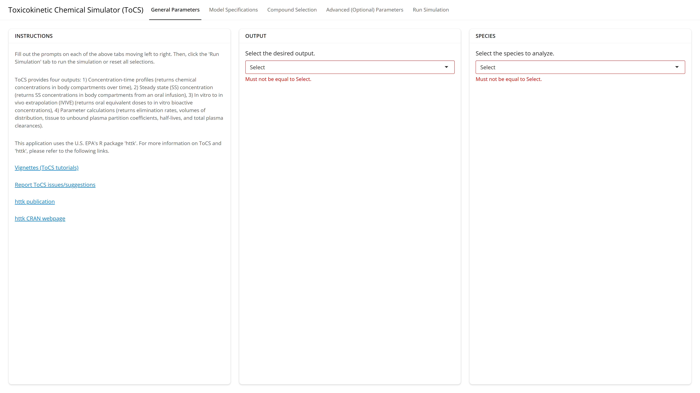
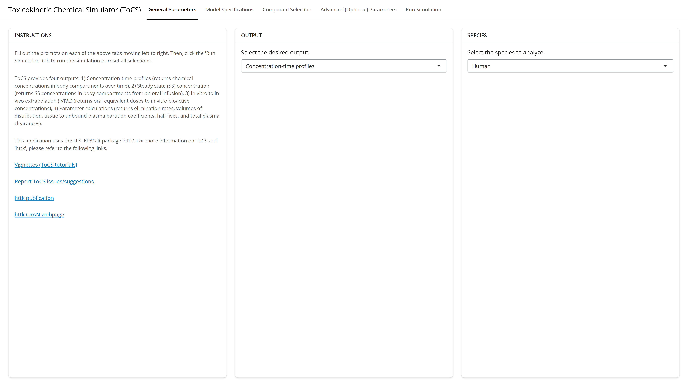
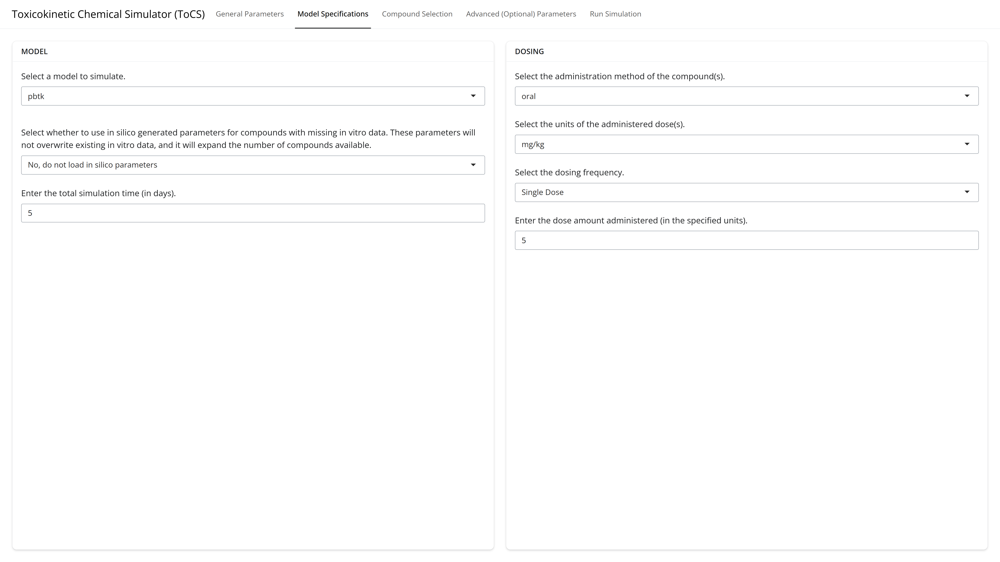
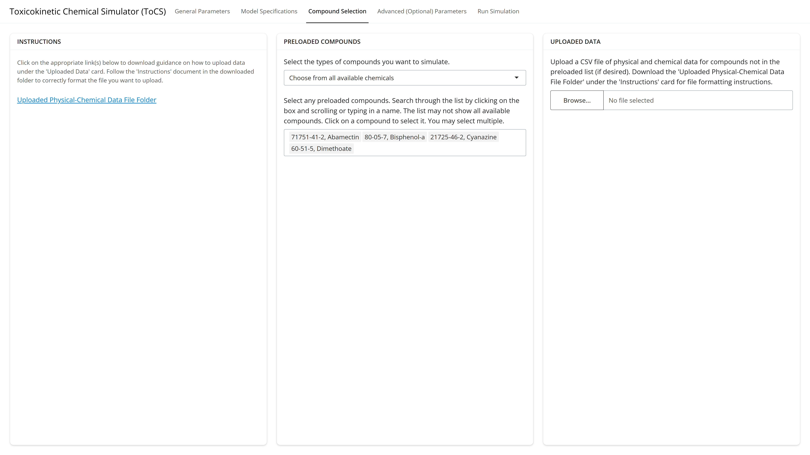
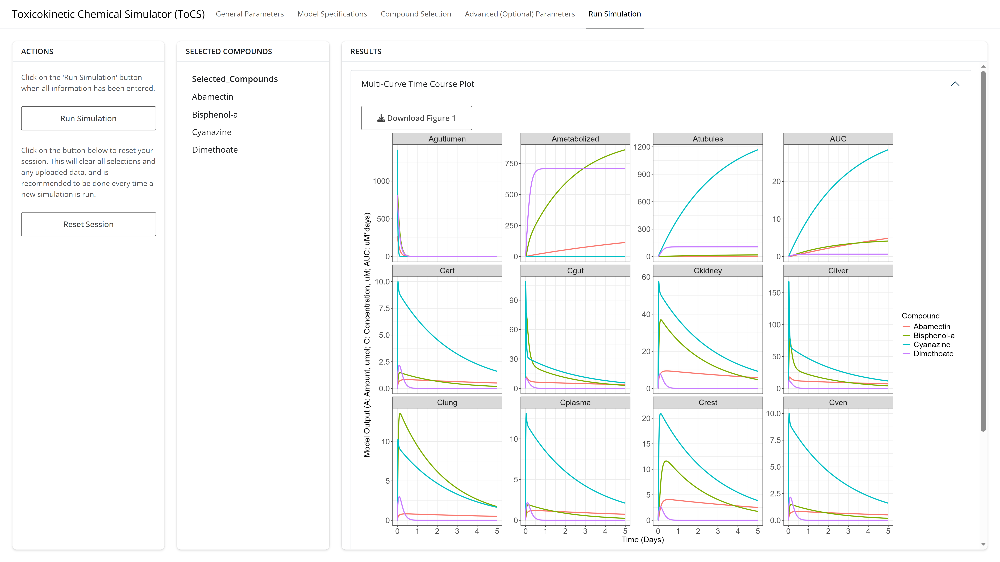
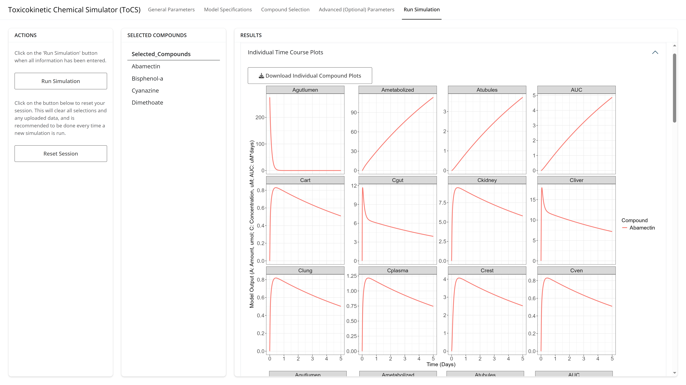

# ToCS <a href="https://kristenwindoloski.github.io/ToCS/"></a>

## Description

ToCS is an R package and web application that serves as a graphical user
interface (GUI) for high-throughput simulation of chemical
toxicokinetics (TK) and in vitro in vivo extrapolation (IVIVE). The GUI
builds upon the EPA’s httk R package
(<https://cran.r-project.org/web/packages/httk/index.html>,
<https://www.jstatsoft.org/article/view/v079i04>), which utilizes
general mathematical models to make high-throughput toxicokinetic
predictions for chemicals with little available data. This GUI is an
easy-to-use computational toxicology tool to predict:

- Concentration-time profiles
  - Generates ADME time course data, plots concentration curves over
    time, and provides summary statistics such as time to maximal
    concentration (Tmax), maximal concentration (Cmax), and area under
    the curve (AUC) for all model compartments across each chemical
- Steady state concentrations
  - Produces a table and plot of the analytical steady state
    concentration for the desired concentration and tissue of all
    selected compounds as well as a table estimating the time (days) it
    takes to reach steady state behavior for all compounds
- In vitro in vivo extrapolation (IVIVE)
  - Generates a table and plot of OEDs (oral equivalent dose, the
    external dose needed to produce the internal bioactive
    concentration) for all simulated chemicals. If exposure data is
    provided by the user, the GUI will also plot the exposure data
    against the OEDs as well as calculate the bioactivity exposure
    ratio, which can be used to prioritize chemicals for further risk
    evaluation
- Parameter calculations
  - Calculates tables and plots of TK parameters including the
    half-life, total plasma clearance, elimination rate, volume of
    distribution, and partition coefficients of the selected chemicals

without the need to know R or any programming. While other GUIs have
been created that use httk (Integrated Chemical Environment (ICE),
<https://ice.ntp.niehs.nih.gov/>) and share similar outputs to those in
this GUI, ToCS is unique in that it:

- Contains a complete pregnancy model from conception to birth (using
  httk’s new solve_full_pregnancy function)
- Calculates the area under the curve (AUC) and time to maximum
  concentration for all model compartments
- Offers computation of analytical steady state concentrations and oral
  equivalent doses (OEDs) for all model and other tissue compartments,
  not just plasma
- Predicts the bioactivity exposure ratio (BER) and plots the OEDs
  against exposure estimates given user-uploaded chemical exposure data,
  which can be used to prioritize chemicals for further risk assessment
- Provides estimates of TK parameters not only including half-lives but
  also total plasma clearances, volumes of distribution, elimination
  rates, and partition coefficients
- Estimates the number of days it takes for compounds to reach plasma
  steady state
- Allows for further customization of simulations beyond basic model
  parameters
- Utilizes the most recent httk version (2.7.0)
- Allows for non-uniform chemical exposure (dosing), which can be
  beneficial for users interested in food chemicals
- Offers simulations for dog, rabbit, and mouse species in addition to
  human and rats
- Includes the option to include in silico-generated parameters within
  httk if in vitro hepatic clearance, fraction unbound in plasma, and/or
  caco-2 membrane permeability data is missing
- Offers the option to convert the nominal bioactive concentration to a
  free concentration in vitro for IVIVE simulations (recommended)
- Allows the user to declare the desired quantile of predicted OEDs and
  view all generated OED samples
- Has a subset of food-related compounds (direct and indirect food
  additives) that users can easily view and select from

ToCS is a toxicokinetics application that can be used by scientists with
little to no modeling or programming backgrounds, and requires a small
amount of user input to generate basic simulations. If desired,
simulations can be highly customizable through the Advanced Parameters
tab in ToCS. Additional considerations have also been included to make
the app aimed at users interested in toxicokinetics of food-related
chemicals.

## Getting Started

There are two ways that users can access the ToCS GUI. If the user
selects option 2, then they will also need to have the free statistical
computing language, R, installed on their computer
(<https://www.r-project.org/>). Although optional, users may also want
to install RStudio (<https://posit.co/download/rstudio-desktop/>) as a
more user-friendly programming environment for R code. The following are
the ways that the user can access the ToCS GUI:

1.  Using the online application
    (<https://pub-connect.foodsafetyrisk.org/tocs>)
2.  Through R as an R package:
    - Open R or RStudio.

    - Install the ‘remotes’ package in R if not already available by
      typing the following into the R command line:

      ``` r
      install.packages("remotes")
      ```

    - Then, use the ‘remotes’ package function ‘install_github()’ to
      install ToCS by typing the following into the R command line:

      ``` r
      remotes::install_github("KristenWindoloski/ToCS")
      ```

    - The above command may install additional packages into your R
      environment if you are missing any of the dependent packages in
      ToCS. Once this installation is complete, then type the following
      into the R command line to open the ToCS interface:

      ``` r
      ToCS::run_ToCS()
      ```

Either of these two methods above will result in the ToCS interface
appearing. If the user successfully opens the app, their screen should
look like the image below.

<br/><br/>

<figure>

<figcaption aria-hidden="true">The opening interface to the ToCS
app.</figcaption>
</figure>

<br/><br/>

Once in the interface, the user fills out any drop downs, text boxes, or
other selections on each of the five main tabs at the top of the GUI
moving left to right. Once the user has completed all of their
selections, they will run the simulation and receive the results on the
final tab, *Run Simulation*.

The section below provides a starting example for users to get familiar
with the ToCS software. Additional examples for each major output module
of the GUI can be found in the ToCS vignettes
(<https://github.com/KristenWindoloski/ToCS/tree/main/vignettes>).

## Concentration-Time Profile Example

Let’s say we want to run a simulation that outputs human
concentration-time profiles over the course of five days for four
compounds: Abamectin (CAS: 71751-41-2), Bisphenol-A (CAS: 80-05-7),
Cyanazine (CAS: 21725-46-2), and Dimethoate (CAS: 60-51-5). The
simulation will be for a single 5 mg/kg oral exposure of each compound
and use the PBTK model without including in silico generated parameters
in place of in vitro data (hepatic clearance, fraction unbound in
plasma, and caco-2 permeability).

#### General Parameters Tab

Since the main output we want is concentration-time profiles, we select
*Concentration-time profiles* from the drop down menu under the *Output*
card. Under the *Species* card, we select *Human* species. Thus, the
first tab should look like the page below.

<br/><br/>

<figure>

<figcaption aria-hidden="true">A completed opening interface to the ToCS
app.</figcaption>
</figure>

<br/><br/>

Now, we move on to the *Model Specifications* tab.

#### Model Specifications Tab

On the *Dosing* card, we leave the first two drop down menus as their
default values. For the dosing frequency, we select *Single Dose* from
the drop down menu. This prompts the appearance of a textbox where we
can input the number of mg/kg to be administered. We change its value to
5 since we want a single 5 mg/kg exposure. On the *Model* card, we
select *pbtk* for the pbtk model on the first drop down menu. Since we
do not want to use in silico generated parameters for this simulation,
we select *No* for the second drop down menu under the *Model* card.
Finally, since we only want to run our simulation for five days, we edit
the bottom box in the *Model* card to be 5 instead of the default value
of 10. Now the *Model Specifications* tab is completed and should look
like the image below, so we can proceed to the *Compound Selection* tab.

<br/><br/>

<figure>

<figcaption aria-hidden="true">The completed model specifications tab
for the pbtk model with a single oral dose of 5 mg/kg.</figcaption>
</figure>

<br/><br/>

#### Compound Selection Tab

Since we want to simulate four compounds (abamectin, bisphenol-a,
cyanazine, and dimethoate), we try searching the drop down menu under
the *Preloaded Compounds* card to see if the program is able to simulate
those chemicals with the current data in httk. To see the available
compounds, click on the empty box in the center column. We can see
already from the drop down menu in the image below that Abamectin is
available, so we click that compound. Remember that the user can search
for a compound by either its CAS number or chemical name.

<br/><br/>

<figure>

<figcaption aria-hidden="true">The compound selection tab’s list of
available preloaded compounds based on previous user
selections.</figcaption>
</figure>

<br/><br/>

By either scrolling or typing in the textbox, we see that the names of
the other three compounds are also available, so we select those. Since
all of the compounds we need are available, we do not need to upload a
CSV file of chemical data under the *Uploaded Data* card and leave it
untouched. So, the final *Compound Selection* tab should look like the
image below and then we proceed to the next tab.

<br/><br/>

<figure>

<figcaption aria-hidden="true">The completed compound selection card for
example 1.</figcaption>
</figure>

<br/><br/>

#### Advanced (Optional) Parameters Tab

For simplicity of this example, we will leave all selections and inputs
on this tab alone and proceed to the next and final tab.

#### Run Simulation Tab

All input selections are complete and the correct compounds appear under
the *Selected Compounds* card, as shown in the image below. Therefore,
we hit the *Run Simulation* button under the *Actions* card so ToCS can
compute the solution. The output will appear in the *Results* window
when complete. Depending on the number of compounds selected to
simulate, the results may take several seconds to populate.

<br/><br/>

<figure>

<figcaption aria-hidden="true">The run simulations tab appearance before
the “Run Simulation” button under the <em>Actions</em> card is
clicked.</figcaption>
</figure>

<br/><br/>

The image below shows the first drop down in the *Results* card once the
simulation is complete. The user sees the complete time course curves of
all four chemicals in each model compartments overlaying each other. The
legend for the figure is located in the bottom right corner, and a
figure description describing the y-axis of each subplot is located
below the figure. The user also has the option to download this figure
by clicking *Download Figure 1*.

<br/><br/>

<figure>

<figcaption aria-hidden="true">The multi-curve plot output and download
option for example 1.</figcaption>
</figure>

<br/><br/>

The second drop down in the *Results* card, as seen below, shows the
user the same plots as seen in the first drop down tab but with each
compound on a separate plot. The user has the option to download all
individual plots as a zip file. A figure caption is also located under
the very last plot in this tab.

<br/><br/>

<figure>

<figcaption aria-hidden="true">The individual plots output and download
option for example 1.</figcaption>
</figure>

<br/><br/>

The third drop down in the *Results* card allows the user to download
the time course simulation data that was used to generate the plots in
the two drop downs above. The user can also download all of the inputted
simulation parameters as well as the chemical data used in the
simulations. Opening the bottom drop down in the *Results* card shows a
toxicokinetic summary including the Tmax (time to maximal
concentration), Cmax (maximal concentration), and AUC (area under the
curve) of all simulated compounds within each model compartment. The
table is available for download if the user clicks *Download Table 1*.
See the image below for the final two drop downs.

<br/><br/>

<figure>

<figcaption aria-hidden="true">The simulation data download feature and
toxicokinetic (TK) summary drop down table for example 1.</figcaption>
</figure>

<br/><br/>

If the user wanted to run another simulation, it is recommended to click
the *Reset Session* button under the *Actions* card, which would clear
all parameter inputs and simulations and return the interface to the
*General Parameters* tab.

<br/><br/>

### Getting Help

The vignettes provided are intended to be user guides on how to run the
GUI. It is strongly recommended to consult them before running a
simulation. Each remaining vignette works through several examples for
each output module. To view the vignettes, visit the GitHub page
(github.com/KristenWindoloski/ToCS/tree/main/vignettes) and click any of
the PDF vignette files.

If a user runs into an error, text will appear. If a red pop-up box
appears on the *Run Simulation* page, then the user has typically
forgotten to enter a parameter or has a formatting error in a file they
uploaded, so the user should follow the instructions of the error
statement. If red error text appears under one of the drop downs on the
*Run Simulation* page, then the user should report the error to the ToCS
GitHub page (<https://github.com/KristenWindoloski/ToCS/issues>).
