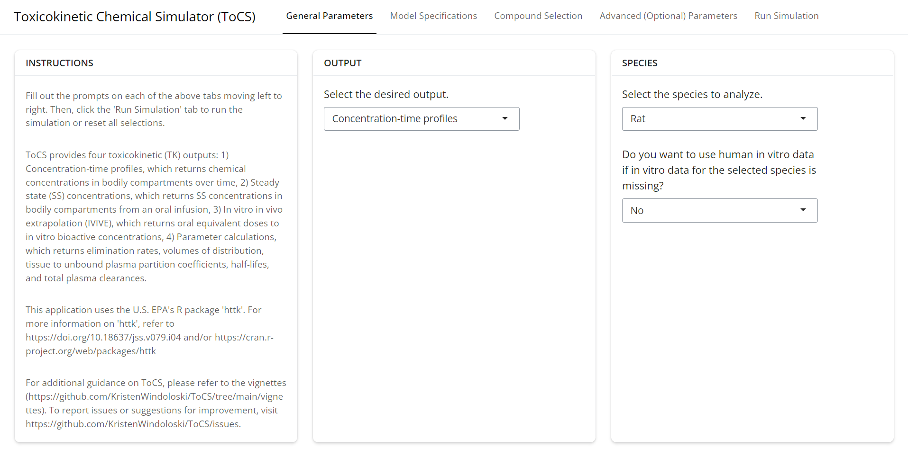
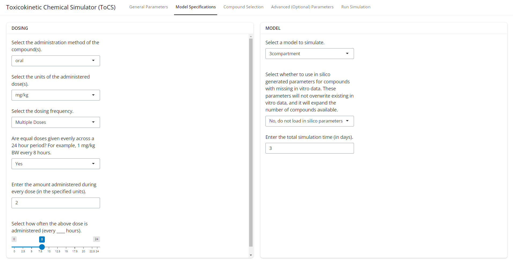

```{r, include = FALSE}
knitr::opts_chunk$set(
  collapse = TRUE,
  comment = "#>"
)
```

If you have not read the *Introduction to the ToCS App* vignette, it is highly recommended to do so in order to get a general idea of the app's layout and obtain a detailed description of common features across all output modules. Users should also review the README file to set up the ToCS app if it is being loaded through your local R or RStudio application. This vignette assumes that you have access the ToCS app GUI already.

### Introduction

This vignette provides three examples that use the ToCS app to generate concentration-time profiles, each example with different parameters selected. To begin, open the app by typing the following two lines in the R command line if opening ToCS on your local computer from R or RStudio:

```{r, eval = FALSE}
devtools::load_all(.)
ToCS()
```

This will open a pop up window with the app in it. If you're accessing ToCS on the web, then open the webpage. Your screen should look like this:

{width="100%"}

# Example 1

For this example, let's say we want to run a simulation that outputs concentration-time profiles for humans with 3 compounds: Abamectin, Ibuprofen, and .

### General Parameters Tab

Since our main output we want is concentration-time profiles, we select *Concentration-time profiles* from the middle drop down menu. We select *Human* species and, while it does not matter in this scenario what we select for the second drop down in the *Species* card since we selected human species, we select *Yes* to use human in vitro data. You could also select *No* for human in vitro data as well and you should get the same output regardless. Thus, the first tab should look like the page below.

<br/><br/>

{width="100%"}

<br/><br/>

Now, we move on to the *Model Specifications* tab.

### Model Specifications Tab

On the *Dosing* card, we leave the first two drop down menus as their default values. For the dosing frequency, we select *Single Dose* from the drop down menu. This prompts the appearance of a textbox where we can input the number of mg/kg to be administered. We change its value to 5 since we want a single 5 mg/kg dose administered. On the *Model* card, we select *pbtk* for the pbtk model on the *model* drop down menu. Since we do not want to use in silico generated parameters for this simulation, we select *No* for the second drop down menu under the *Model* card. Finally, since we only want to run our simulation for 1 day, we edit the bottom box in the *Model* card to be 1 instead of 10. Now the *Model Specifications* tab is completed and should look like the image below, so we can proceed to the *Compound Selection* tab.

<br/><br/>

{width="100%"}

<br/><br/>

### Compound Selection Tab

Since we are looking for to simulate four compounds (Abamectin, bisphenol-a, cyanazine, and dimethoate), we try searching the preloaded compounds in the center column to see if the program is able to simulate those chemicals with the current data in httk. To see the preloaded compounds available, click on the empty box in the center column. We can see already from the drop down menu in the image below that Abamectin is available, so click that compound. 

<br/><br/>

{width="100%"}

<br/><br/>

By either scrolling or typing in the textbox, the names of the other three compounds are also available in the preloaded compounds list, so we select those. Then, we hit the *Load Compounds* button in the left column as shown in the image below before proceeding to the next tab.

<br/><br/>

{width="100%"}

<br/><br/>


### Advanced (Optional) Parameters Tab

For simplicity of this example, we will leave all selections and inputs on this tab alone and proceed to the next and final tab.

### Run Simulation Tab

All input selections are complete and the correct compounds appear under the *Selected Compounds* card. Therefore, we hit the *Run Simulation* button on the left side so ToCS can compute the solution. The output will appear in the *Results* window when complete.

<br/><br/>

{width="100%"}

<br/><br/>

The first drop down in the *Results* card shows the user the complete time course curves of all selected chemicals in all model compartments with the chemicals overlaying each other. The user has the option to download this plot figure by clicking *Download Figure 1*.

<br/><br/>

{width="100%"}

<br/><br/>

The second drop down in the *Results* card shows the user the same plots as seen in the drop down above, but with each compound on a separate plot. The user has the option to download all individual plots as a zip file.

<br/><br/>

{width="100%"}

<br/><br/>

The third drop down in the *Results* card allows the user to download the time course simulation data that was used to generate the plots in the two drop downs above. The user can also download all of the inputted simulation parameters as well as the chemical data used in the simulations.

<br/><br/>

{width="100%"}

<br/><br/>

Opening the bottom drop down in the *Results* card shows a toxicokinetic summary including the Tmax, Cmax, and AUC of all simulated compounds within each model compartment. The table is available for download if the user clicks *Download Table 1*.

<br/><br/>

{width="100%"}

<br/><br/>

If we wanted to run another simulation, we would click *Reset Session*, which would clear all parameter inputs and bring us back to the *General Parameters* tab.

<!-- # Example 2 -->

<!-- ### General Parameters Tab -->

<!-- As with example 1, we select *Concentration-time profiles* as the desired output. However this time, we select *Rat* species. Now this time, let's say we only want to use rat in vitro data instead of using human in vitro data for compounds missing rat data. Thus, we select *No* for the second drop down menu. The first tab should look like the page below. -->

<!-- {width="100%"} -->

<!-- ### Model Specifications Tab -->

<!-- {width="100%"} -->

<!-- ### Compound Selection Tab -->

<!-- {width="100%"} -->

<!-- ### Advanced (Optional) Parameters Tab -->

<!-- ### Run Simulation Tab -->

<!-- ## Example 3 -->

<!-- ### Model Specifications Tab -->

<!-- ### Compound Selection Tab -->

<!-- ### Advanced (Optional) Parameters Tab -->

<!-- ### Run Simulation Tab -->
