```{r, include = FALSE}
knitr::opts_chunk$set(
  collapse = TRUE,
  comment = "#>",
  message = FALSE,
  warning = FALSE
)
```


If you have not already read the *Introduction to the ToCS App* vignette, it is highly recommended to do so to get a general idea of the app's layout and obtain a detailed description of common user inputs across all output modules. Users should also review the README file on the ToCS GitHub page (github.com/KristenWindoloski/ToCS) to setup ToCS if they have not accessed the app yet. This vignette assumes that you have access the ToCS app GUI already.

<br/><br/>

# Introduction

This vignette provides three examples that use the ToCS app to generate oral equivalent doses (OEDs) by in vitro in vivo extrapolation (IVIVE), each example with different parameters selected. To begin, open the app by using any of the methods described in the README file. You have correctly accessed the app if your screen looks like the image below.

<br/><br/>

{width="100%"}

<br/><br/>

## Example 1

Let's say we want to perform IVIVE for eight chemicals that we have bioactivity data for. Since the IVIVE produces an OED for each bioactive concentration, assume that we want to transform the nominal bioactivity data to a free concentration in vitro. When the solution is outputted, we want the 5th dose quantile human plasma OED calculated from the pbtk model.

### General Parameters Tab

Since we want to perform IVIVE, we select the *In vitro in vivo extrapolation (IVIVE)* option under the drop down menu from the *Output* card. Then under the *Species* card, we select *Human* for the first drop down and *Yes* for the second drop down. As with other vignettes, we could have selected *No* for the second drop down menu under the *Species* card and it would not make a difference in the simulation results since the selected species is already human. Thus, the completed *General Parameters* tab should look like the image below.

<br/><br/>

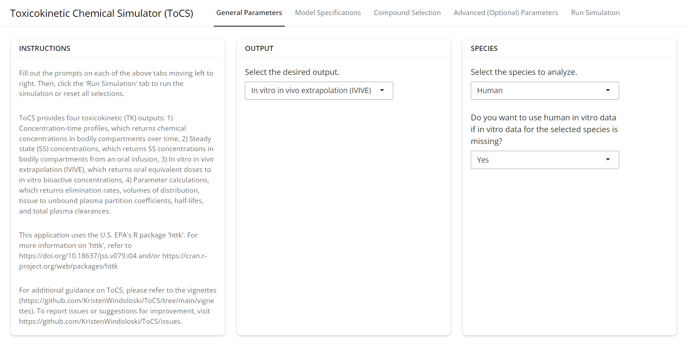{width="100%"}

<br/><br/>

### Model Specifications Tab

Under the *Dosing* card, we see that there are no user specifications to be made for this module. However, there are several user choices to be made under the *Model* card. Since we want to use the pbtk model for IVIVE, we select *pbtk* for the first drop down. For the second drop down we select *No* and decide to not make compounds with only in silico generated parameters available for this example. For the third item under the *Model* card, we have to upload a csv file with the bioactive concentration (uM) of each of the compounds we want to simulate. Therefore, we upload the following csv table. Note that the table must have the following exact format.

<br/><br/>

```{r echo = FALSE, results='asis'}
library(knitr)
library(kableExtra)
SampleChemsToUpload <- read.csv("SampleBioData_8Chems.csv")
kable(SampleChemsToUpload, caption = "A csv file with bioactivity data for all eight chemicals. For the purpose of this example, the bioactivity data provided in this csv is fictional.") %>%    kable_styling() %>%
  scroll_box(width = "100%")
```

<br/><br/>

Then, the fourth drop down menu asks the user whether they want to return a single OED per compound (a selected quantile) or all OED samples per compound. Since we only want the 5th OED quantile (95th steady state concentration quantile), we select *Only return a specified dose quantile (default)*. This prompts the appearance of an additional numeric input box where we want to enter the desired steady state concentration quantile. Since we want the 95th steady state concentration quantile (5th OED quantile), we leave the input as *0.95*. Thus, the completed *Model Specifications* tab should look like the two images below.

<br/><br/>

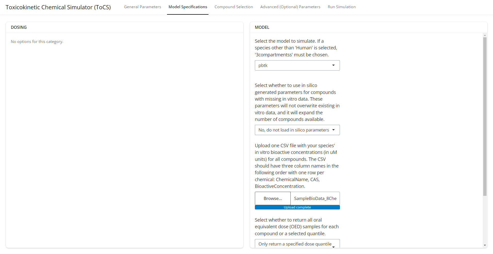{width="100%"}

<br/><br/>

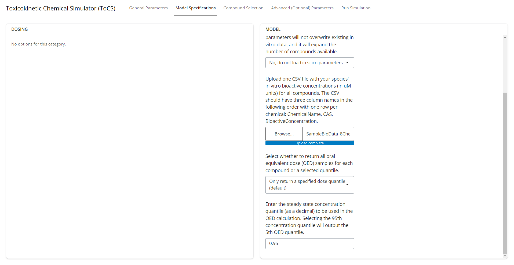{width="100%"}

<br/><br/>

### Compound Selection Tab

Different from the other modules and vignettes, the first drop down menu under the *Preloaded Compounds* card has the user select a set of assumptions to implement regarding in vitro and in vivo bioactivity as well as metabolic clearance. The user can select from the following options:

  - NULL: 
    - Default assumptions applied (listed below) or customizable in the Advanced Parameters tab
    - Restrictive metabolic clearance (protein binding taken into account in liver clearance)
    - Treats the total specified concentration or tissue as bioactive in vivo
    - Treats the nominal concentration in vitro as bioactive
  - Honda1: 
    - Restrictive metabolic clearance (protein binding taken into account in liver clearance)
    - Treats the unbound (free) venous plasma concentration in vivo as bioactive
    - Treats the unbound (free) concentration in vitro as bioactive
  - Honda2: 
    - Restrictive metabolic clearance (protein binding taken into account in liver clearance)
    - Treats the unbound (free) venous plasma concentration in vivo as bioactive
    - Treats the nominal concentration in vitro as bioactive
  - Honda3: 
    - Restrictive metabolic clearance (protein binding taken into account in liver clearance)
    - Treats the total venous plasma concentration in vivo as bioactive
    - Treats the nominal concentration in vitro as bioactive
  - Honda4: 
    - Non-restrictive metabolic clearance (protein binding not taken into account in liver clearance)
    - Treats the total specified tissue concentration in vivo as bioactive
    - Treats the nominal concentration in vitro as bioactive

For more details, see the EPA's httk documentation and/or the following publication https://doi.org/10.1371/journal.pone.0217564. Since we want to use the unbound (free) concentration in vitro as bioactive instead of the nominal concentration, we select the *Honda1* assumption for the first drop down menu. This then results in a new box below asking the user to specify the fraction fetal bovine serum. We apply the assumption that it is 0.1 for the bioactivity assays for our selected compounds and leave the box at *0.1*. Another box below also appears and contains a list of preloaded compounds that we can select from. We search for the same eight compounds that we uploaded bioactivity data for and see that they are all present in the preloaded list. Thus, we select those compounds, ignore the *Uploaded Compounds* card, and click the *Load Compounds* button under the *Instructions* card. The completed *Compound Selection* tab should look like the images below.

<br/><br/>

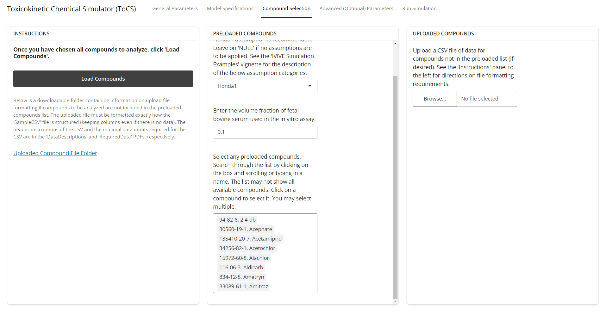{width="100%"}

<br/><br/>

### Advanced (Optional) Parameters Tab

We omit changing any advanced parameter options for this example and leave all parameter values as the default (image shown below). The user can proceed to the next tab.

<br/><br/>

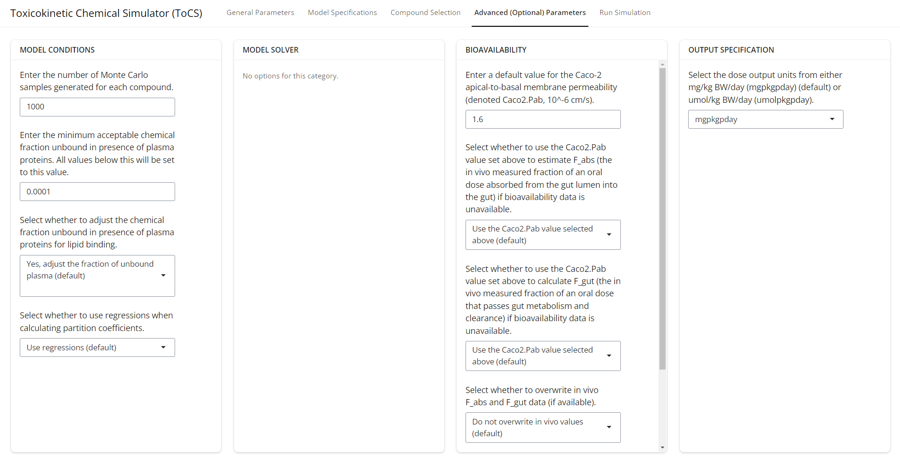{width="100%"}

<br/><br/>

### Run Simulation Tab

Now that all user parameter selections have been made and all compounds appear under the *Select Compounds* card, we click the *Run Simulation* button. Once the simulation is complete, the user's interface should look like the image below. The first tab shows a table of the OED for each compound. The table is available for download by the user if the user clicks the *Download Table 1* button. The user is also able to download all of the simulation parameters and chemical information used in the simulation by clicking the *Download OED Simulation Parameters* tab.

<br/><br/>

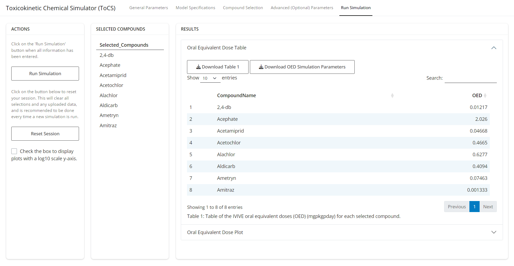{width="100%"}

<br/><br/>

The image below is the completed OED plot tab, which shows the OED for each compound plotted in ascending order. The plot shown below uses a linear y-axis, but as we can see, this makes it challenging to visually see the difference between the smaller OEDs.

<br/><br/>

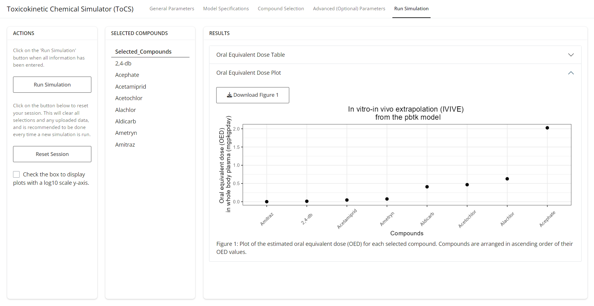{width="100%"}

<br/><br/>

Therefore, we can click the box under the *Actions* card to change the scale of the y-axis to a log10 scale. That then results in the image shown below, which allows the user to view the differences in magnitudes of all OEDs. The user can download either the linear or log10 scale plot by clicking the *Download Figure 1* button.

<br/><br/>

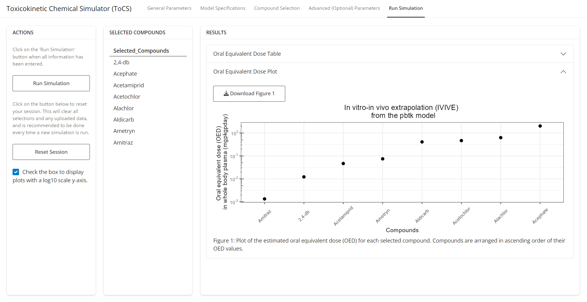{width="100%"}

<br/><br/>

If we wanted to run another simulation, we would click the *Reset Session* button under the *Actions* button, which would clear all parameter inputs and simulations and return the interface to the *General Parameters* tab.

<br/><br/>

## Example 2

Let's say we want to perform human IVIVE for ten chemicals that we have bioactivity data for. Assume that we want to use the nominal plasma in vitro bioactivity data as the bioactive concentration instead of the free concentration in vitro, and we want to use restrictive clearance. When the solution is outputted, suppose that we want to view all generated plasma OED samples calculated from the 3compartmentss model.

### General Parameters Tab

Since we want to perform IVIVE, we select the *In vitro in vivo extrapolation (IVIVE)* option under the drop down menu from the *Output* card. Then under the *Species* card, we select *Human* for the first drop down and *Yes* for the second drop down. As with other vignettes, we could have selected *No* for the second drop down menu under the *Species* card and it would not make a difference since the selected species is already human. Thus, the completed *General Parameters* tab should look like the image below.

<br/><br/>

{width="100%"}

<br/><br/>

### Model Specifications Tab

Under the *Dosing* card, there are no options to select from. Under the *Model* card, we select *3compartmentss* for the first drop down. For the second drop down, we select *Yes* and decide to make compounds with only in silico generated parameters (hepatic clearance, fraction unbound in plasma) also available for this example. For the third item under the *Model* card, we have to upload a csv file with the nominal plasma in vitro bioactive concentration (uM) of each of the compounds we want to simulate. Therefore, we upload the following csv table. The csv file must have the exact format as the table below.

<br/><br/>

```{r echo = FALSE, results='asis'}
library(knitr)
library(kableExtra)
SampleChemsToUpload <- read.csv("SampleBioData_10Chems.csv")
kable(SampleChemsToUpload, caption = "A csv file with bioactivity data for all ten chemicals. For the purpose of this example, the bioactivity data provided in this csv is fictional.") %>%    kable_styling() %>%
  scroll_box(width = "100%")
```

<br/><br/>

Then, the fourth drop down menu asks the user whether they want to return a single OED per compound (a selected quantile) or all OED samples per compound. Since we want to output all generated OED samples, we select *Return all OED samples (will also return the 5th dose quantile)*. Thus, the completed *Model Specifications* tab should look like the two images below.

<br/><br/>

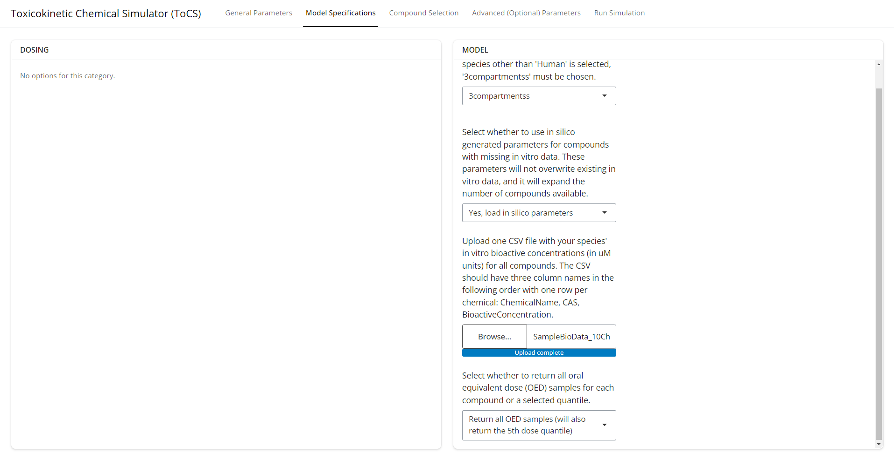{width="100%"}

<br/><br/>

### Compound Selection Tab

As with the first example, the first drop down menu under the *Preloaded Compounds* card has the user select a set of simulations assumptions to implement. See example 1 above for descriptions of the assumptions. Since we want to use the nominal concentration in vitro as bioactive and restrictive clearance (protein binding taking into account in liver clearance), we select NULL for the first drop down menu (note that we could have also selected Honda3 for the same result). This then results in a new box below containing a list of preloaded compounds that we can select from. We search for the same ten compounds that we uploaded bioactivity data for and see that they are all present in the preloaded list. Thus, we select those compounds, ignore the *Uploaded Compounds* card, and click the *Load Compounds* button under the *Instructions* card. The completed *Compound Selection* tab should look like the images below.

<br/><br/>

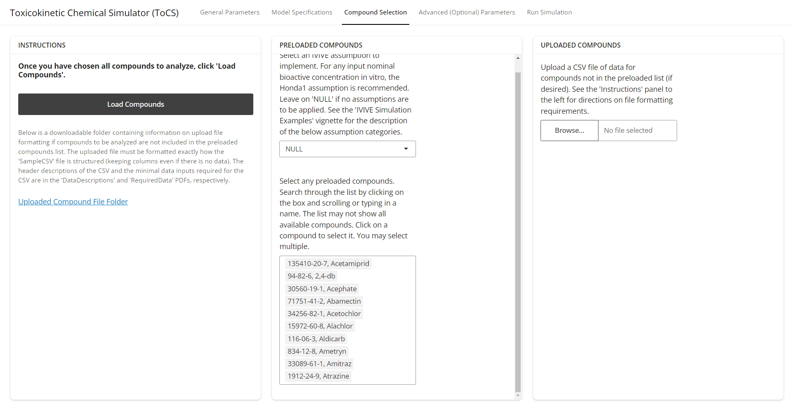{width="100%"}

<br/><br/>

### Advanced (Optional) Parameters Tab

To speed up the computation time of the program, let's change the number of Monte Carlo samples generated for each compound (under the *Model Conditions* card) from 1000 to 500. Then under the *Output Specification* card, since we want to output the plasma OED, we keep the second drop down menu as *plasma*. Thus, the completed *Advanced Parameters* tab should look like the image below.

<br/><br/>

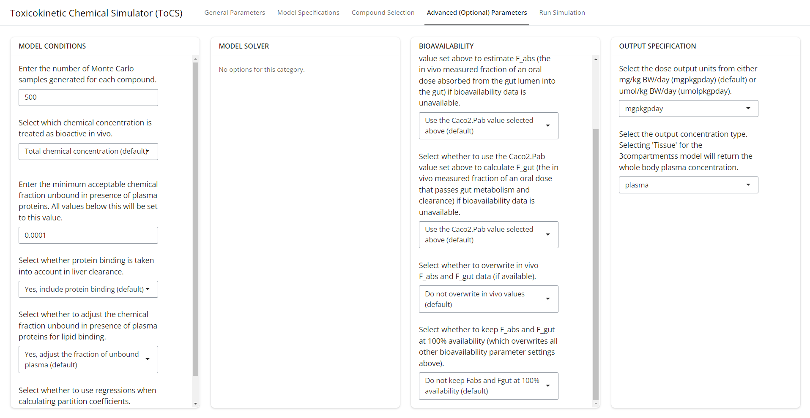{width="100%"}

<br/><br/>

### Run Simulation Tab

Now that all user parameter selections have been made and all compounds appear under the *Select Compounds* card, we click the *Run Simulation* button. Once the simulation is complete, the user's interface should look like the image below. The first tab shows a table of all generated OEDs for each compound (based on different steady state concentrations obtained from Monte Carlo simulations). The first row of the table contains the 5th quantile plasma OED, and then the rows below indicate the sample number and corresponding plasma OED from that sample. The user can view the various pages of samples by clicking the *Next* button at the bottom of the table. The table is available for download by the user if the user clicks the *Download Table 1* button. The user is also able to download all of the simulation parameters and chemical information used in the simulation by clicking the *Download OED Simulation Parameters* tab.

<br/><br/>

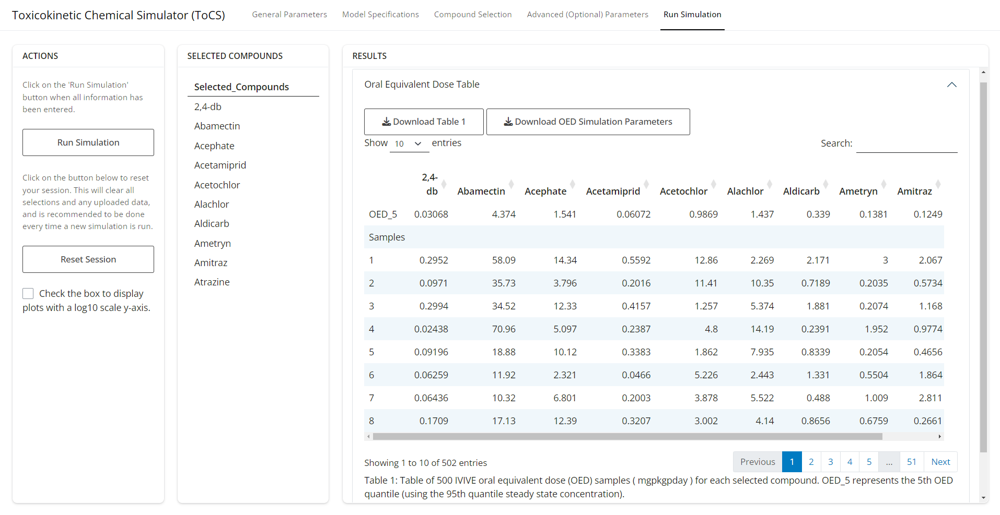{width="100%"}

<br/><br/>

The image below is the completed OED plot tab, which shows boxplots describing the distribution of all OED samples for each simulated compound. The black dots are outlying samples, and the large red dots represent the 5th quantile OED from the OED table in the previous drop down tab. The plot shown below uses a linear y-axis, but as we can see, this makes it challenging to visually see the distribution of samples for smaller OEDs.

<br/><br/>

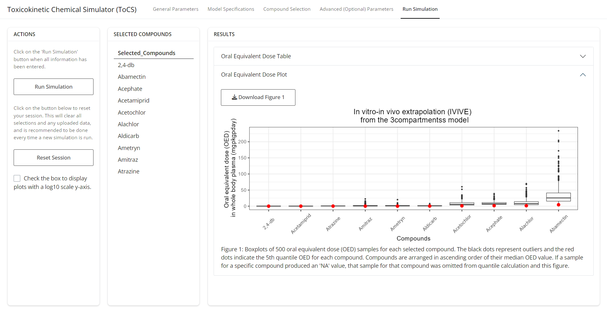{width="100%"}

<br/><br/>

Therefore, we can click the box under the *Actions* card to change the scale of the y-axis to a log10 scale. That then results in the image shown below, which allows the user to view the OED sample distributions of all compounds. The user can download either the linear or log10 scale plot by clicking the *Download Figure 1* button.

<br/><br/>

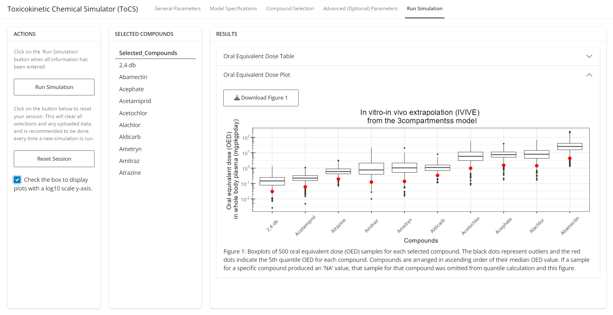{width="100%"}

<br/><br/>

If we wanted to run another simulation, we would click the *Reset Session* button under the *Actions* button, which would clear all parameter inputs and simulations and return the interface to the *General Parameters* tab.

## Example 3

Let's say that we want to perform human IVIVE to obtain 10th quantile liver OEDs using the 3compartment model. We will use the nominal bioactivity data for the eight compounds used in example 1, and want to include restrictive clearance in the model.

### General Parameters Tab

Since we want to perform IVIVE, we select the *In vitro in vivo extrapolation (IVIVE)* option under the drop down menu from the *Output* card. Then under the *Species* card, we select *Human* for the first drop down and *Yes* for the second drop down. As with other vignettes, we select *No* for the second drop down menu under the *Species* card. Thus, the completed *General Parameters* tab should look like the image below.

<br/><br/>

{width="100%"}

<br/><br/>

### Model Specifications Tab

Under the *Dosing* card, there are no options to select from. Under the *Model* card, we select *3compartments* for the first drop down. For the second drop down, we select *No* and decide to make compounds with only in vitro data available for this example. For the third item under the *Model* card, we have to upload a csv file with the nominal plasma in vitro bioactive concentrations of the eight compounds we want to simulate. Therefore, we upload the following csv table. Note that the table must have the following format.

<br/><br/>

```{r echo = FALSE, results='asis'}
library(knitr)
library(kableExtra)
SampleChemsToUpload <- read.csv("SampleBioData_8Chems.csv")
kable(SampleChemsToUpload, caption = "A csv file with bioactivity data for all eight chemicals. For the purpose of this example, the bioactivity data provided in this csv is fictional.") %>%    kable_styling() %>%
  scroll_box(width = "100%")
```

<br/><br/>

Then, the fourth drop down menu asks the user whether they want to return a single OED per compound (a selected quantile) or all OED samples per compound. Since we want to output the 10th quantile OED, we select *Only return a specified dose quantile (default)*. This results in the appearance of another input box. In this final box under the *Model* card, we enter the steady state concentration quantile that we desire to use in our OED calculation (0.90). This will return the 10th quantile OED in the simulation results. Thus, the completed *Model Specifications* tab should look like the two images below.

<br/><br/>

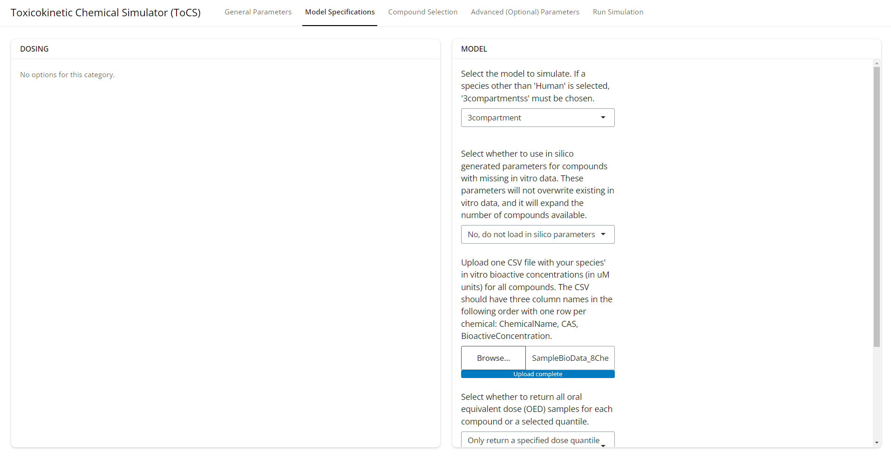{width="100%"}

<br/><br/>

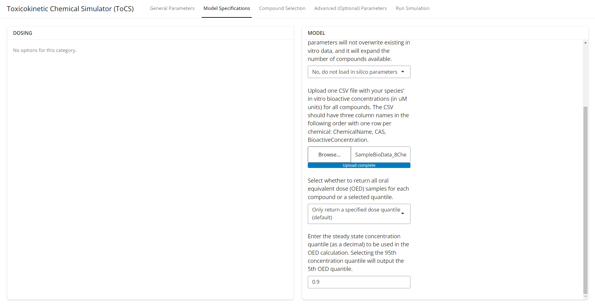{width="100%"}

<br/><br/>

### Compound Selection Tab

As with the first example, the first drop down menu under the *Preloaded Compounds* card has the user select a set of simulations assumptions to implement. See example 1 for descriptions of the assumptions. As with example 2, we will select NULL for the first drop down menu since we wanted to use 1) the nominal in vitro concentration as bioactive, 2) restrictive clearance, and 3) liver tissue as bioactive in vivo. This then results in a new box below containing a list of preloaded compounds that we can select from. We search for the same eight compounds that we uploaded bioactivity data for and see that they are all present in the preloaded list. Thus, we select those compounds, ignore the *Uploaded Compounds* card, and click the *Load Compounds* button under the *Instructions* card. The completed *Compound Selection* tab should look like the images below.

<br/><br/>

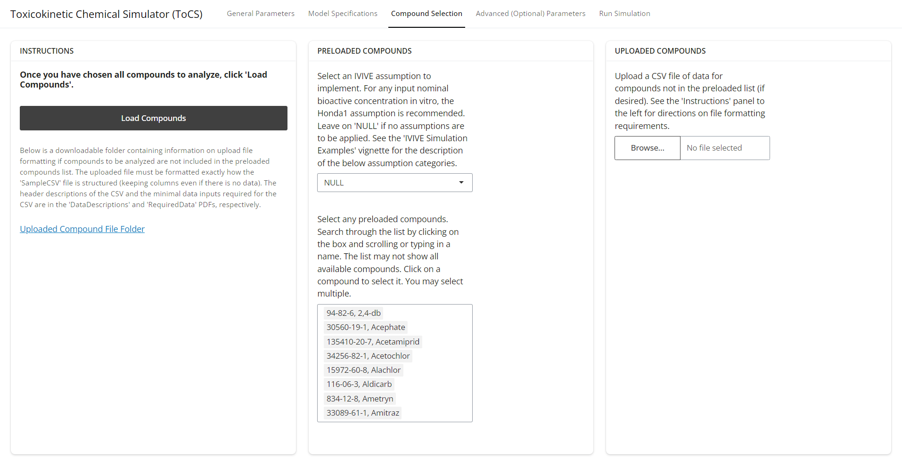{width="100%"}

<br/><br/>

### Advanced (Optional) Parameters Tab

Since we want to output the OED in the liver, we select *tissue* under the second drop down menu in the *Output Specification* card specifying the output concentration type. This prompts the appearance of a third drop down menu. We select *liver* from this menu since we want the liver OED. No changes to other parameters on this page should be made for this example. Thus, the completed *Advanced Parameters* tab should look like the image below.

<br/><br/>

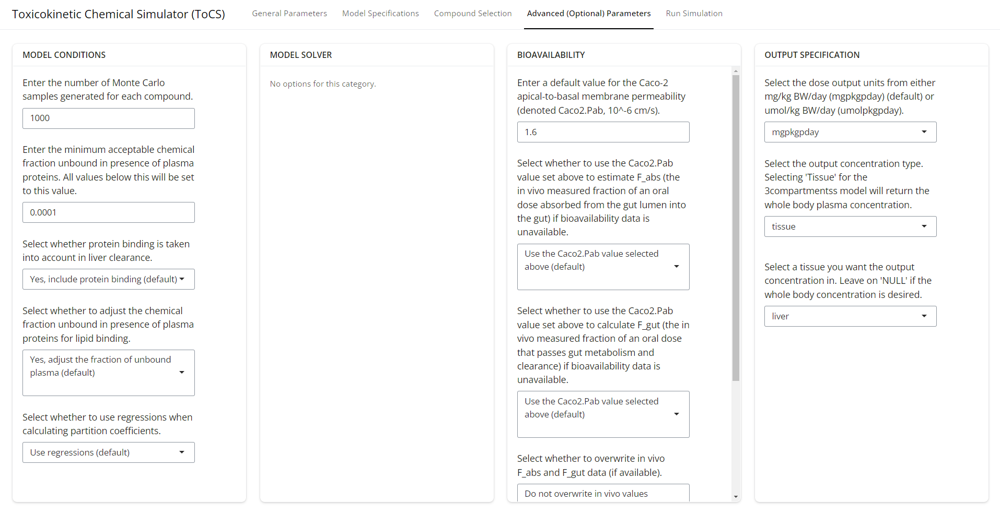{width="100%"}

<br/><br/>

### Run Simulation Tab

Now that all user parameter selections have been made and all compounds appear under the *Select Compounds* card, we click the *Run Simulation* button. Once the simulation is complete, the user's interface should look like the image below. The first tab shows a table of the OED for each compound. The table is available for download by the user if the user clicks the *Download Table 1* button. The user is also able to download all of the simulation parameters and chemical information used in the simulation by clicking the *Download OED Simulation Parameters* tab.

<br/><br/>

{width="100%"}

<br/><br/>

The image below is the completed OED plot tab, which shows a plot of the 10th quantile OEDs using the liver steady state concentration for OED calculation. The plot shown below uses a linear y-axis, but as we can see, this makes it challenging to visually notice the magnitude of smaller OEDs.

<br/><br/>

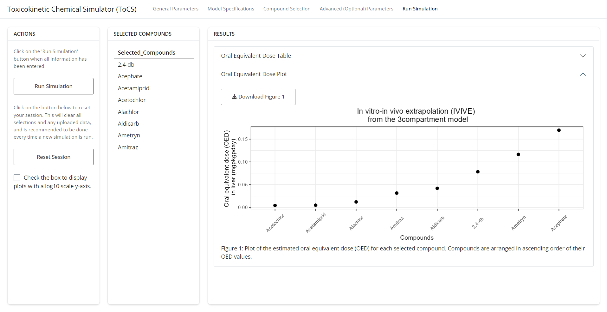{width="100%"}

<br/><br/>

Therefore, we can click the box under the *Actions* card to change the scale of the y-axis to a log10 scale. That then results in the image shown below, which allows the user to view the differences in magnitudes of all OEDs. The user can download either the linear or log10 scale plot by clicking the *Download Figure 1* button.

<br/><br/>

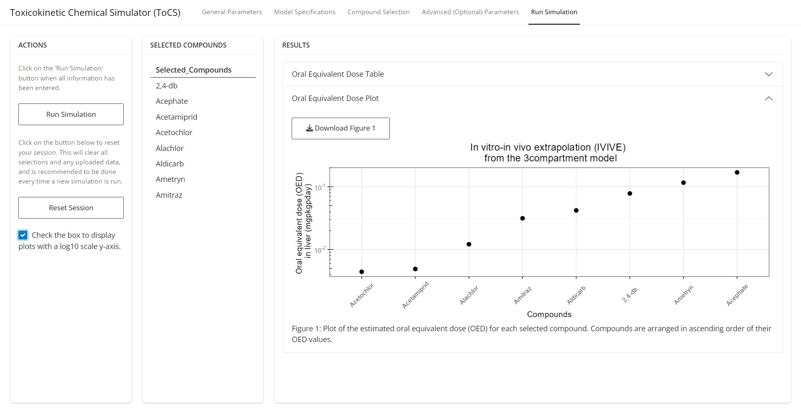{width="100%"}

<br/><br/>

If we wanted to run another simulation, we would click the *Reset Session* button under the *Actions* button, which would clear all parameter inputs and simulations and return the interface to the *General Parameters* tab.
