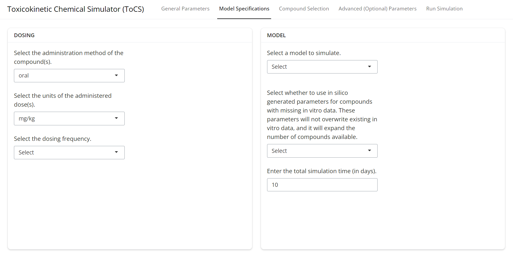
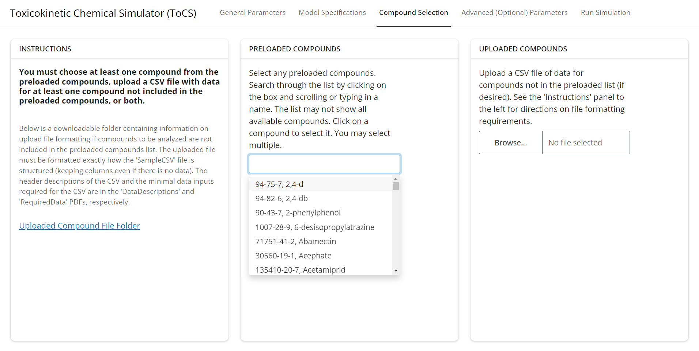
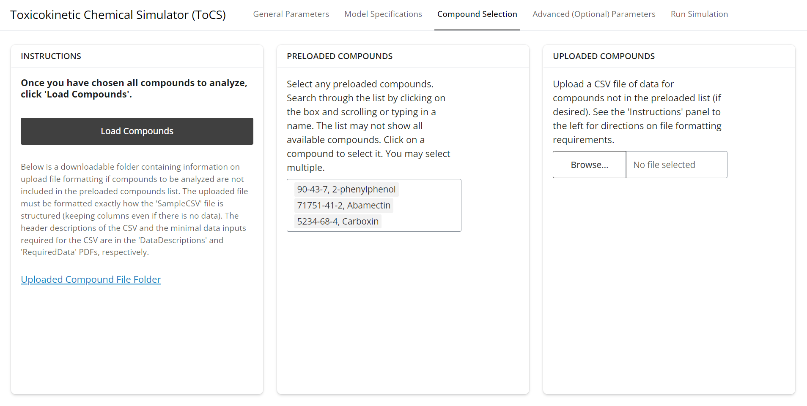
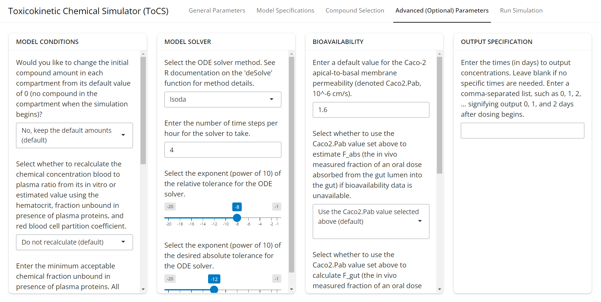
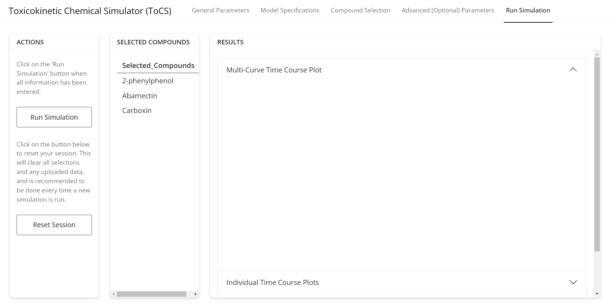
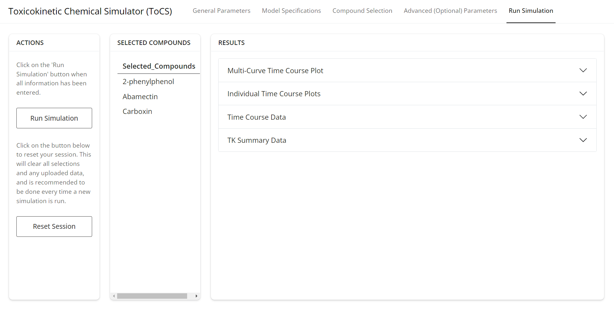

```{r, include = FALSE}
knitr::opts_chunk$set(
  collapse = TRUE,
  comment = "#>",
  message = FALSE,
  warning = FALSE
)
```


This vignette provides an introduction to the ToCS graphical user interface (GUI). Here, we describe what the app is, its general layout and common features, and general advice for using the app.

### App Description and Purpose

ToCS is designed to be an easy to use computational tool that generates relevant toxicokinetic information for user-selected compounds based on little chemical data. The app is built off of the EPA's high-throughput toxicokinetics (httk) R package (https://cran.r-project.org/web/packages/httk/index.html), and provides an easy format to run many the package's main functions without the need to know R. The interface offers a vast majority of the input parameter customizations that can be made to the httk functions, so users of ToCS can either only provide the basic simulation information needed or they can do a deep dive into customization of httk model parameters.

While other GUIs that utilize httk have been created (Integrated Chemical Environment (ICE), https://ice.ntp.niehs.nih.gov/), ours is unique in that it 

- Offers computation of analytical steady state concentrations and oral equivalent doses (OEDs) for each model compartment as well as volumes of distribution, elimination rates, partition coefficients, and other summary statistics for concentration-time profiles
- Calculates the number of days to reach steady state concentration
- Allows for further customization of simulations beyond basic model parameters
- Utilizes the most recent httk version (2.4.0)
- Allows for non-uniform chemical exposure (dosing), which can be beneficial for users interested in food chemicals
- Offers simulations for dog, rabbit, and mouse species in addition to human and rats
- Includes the option to load all in silico parameters within httk
- Offers the option to convert the nominal bioactive concentration to a free concentration in vitro for IVIVE simulations (recommended)
- Allows the user to declare the desired percentile of predicted OEDs and view all generated OED samples.

The app's interface has 5 main tabs, where the user toggles through them left to right to fill out all information on each page before moving to the next one. The final tab, *Run Simulation*, allows the user to submit the parameters to the app and then the app outputs any plots, tables, or download features for the input.

Below, we walk through the interface and features of each tab.


### General Parameters Tab

The *General Parameters* tab acts as a home page for the GUI. The *Instructions* card reminds the user of the app's basic workflow, where to access the vignettes, and where to report bugs. The *Output* card has the user select what their main goal of the using the app is. The user can pick from one of four output modules:

- Concentration-time profiles
  - Generates ADME time course data, plots concentration curves over time, and provides summary statistics such as Tmax, Cmax, and AUC for all model compartments and each chemical
- Steady state concentrations
  - Produces a table and plot of the analytical steady state concentration for the desired concentration and tissue of all selected compounds
- In vitro in vivo extrapolation (IVIVE)
  - Generates a table and plot of OEDs (the external dose concentration needed to produce the internal bioactive concentration) for all simulated chemicals
- Parameter calculations
  - Calculates the elimination rate, volume of distribution, and partition coefficients of the selected chemicals
  
The module selected above then determines the available user selections in the remaining tabs as well as the layout of the output in the *Run Simulation* tab. Before moving on to the next page, the user must also specify the species they wish to simulate (choosing from human, rat, mouse, rabbit, or dog) and whether to substitute human in vitro data if animal in vitro data is not available within httk (though the animal's physiology will still be used). If the user selects *Human*, then the selection you make for the second drop down in the *Species* card will not make a difference, but you must select one. Once the user has selected options for all three drop down menus, then proceed to the *Model Specifications* tab.

<br/><br/>

{width="100%"}

<br/><br/>

### Model Specifications Tab

This tab has different selections depending on which output you selected in the first tab. However, the *Dosing* and *Model* cards will always be present. The *Dosing* card specifies the dosing scenario for the user's simulation, if applicable. The *Model* card has the user select basic model specifications needed to run the model. There are five different models in the first drop down under the *Model* card that may appear:

- 3compartmentss
  - A steady state plasma model describing the rest of body compartment of the 3compartment model
- 1compartment
  - An empirical plasma model with the following compartments: gut lumen and a main absorption compartment
- 3compartment
  - A condensed version of the pbtk model below with the following compartments: gut lumen, gut, liver, and rest of body
- pbtk
  - A physiologically based model with the following compartments: gut lumen, gut, liver, lung, kidney, arterial and venous blood, and rest of body
- fetal_pbtk
  - An extension of the pbtk model to include adipose, thyroid, and placenta compartments as well as an entire fetus model
  
*The rest of body compartment is a collective term lumping all remaining body tissues together.*

For a more in depth look at each model, the user should review the httk documentation (https://cran.r-project.org/web/packages/httk/index.html) and related publications (https://www.jstatsoft.org/article/view/v079i04). Also always appearing under the *Model* card is the option for the user to include in silico generated parameters (hepatic clearance, fraction unbound in plasma, and caco-2 permeability) for compounds with missing in vitro data. The available in silico parameters come from Sipes2017, Pradeep2020, Dawson2021, and Honda2023 data sets in httk. If the user selects *Yes* for this drop down, then an increased number of compounds will become available to simulate. The in silico parameters will not override any in vitro parameters. 

Once all selections have been made for this tab, move on to the *Compound Selection* tab.
<br/><br/>

{width="100%"}

<br/><br/>

### Compound Selection Tab

The layout for this tab primarily looks the same for all modules and includes two cards that correspond to the user declaring the compounds to simulate. At least one compound MUST be selected. The *Preloaded Compounds* card contains a drop down list of compounds that are already present in httk and contain enough data to run simulations. The user will not need to upload any data to simulate these compounds. The drop down list is displayed in the format of "CASRN, Compound Name", and the user can search the list using either chemical identifier. To select a compound, just click on it in the drop down list. Multiple compounds may be selected. Note that only a portion of the compound list will be initially visible during scrolling due to the size of the list, but the application will check the entire list if the user searches a chemical identifier. 

<br/><br/>

{width="100%"}

<br/><br/>

In the card *Uploaded Compounds*, users may upload chemicals that are not available from the drop down menu in the *Preloaded Compounds* card. To do so, users should follow the instructions under the *Instructions* card and download the *Uploaded Compounds File Folder*. This folder contains three files in it. Users should review all three files to ensure they are able to successfully upload new chemicals. The main file, called SampleCSV.csv, contains the exact file format the user needs to upload new chemicals. Columns of the csv file must have these exact names and be in this exact order. It is strongly recommended that users copy the SampleCSV file into a new spreadsheet and replace the sample chemical information with their chemical information. See the sample csv file to upload below.

<br/><br/>

```{r echo = FALSE, results='asis'}
library(knitr)
library(kableExtra)
SampleChemsToUpload <- read.csv("SampleCSV.csv")
kable(SampleChemsToUpload, caption = "A sample csv file to upload to the GUI to simulate chemicals not already in httk.") %>%    kable_styling() %>%
  scroll_box(width = "100%")
```

<br/><br/>

While not all columns of the csv file must contain data, the following columns MUST have data for all uploaded chemicals no matter the output module being run:

- Compound (compound name, a chemical identifier)
- CAS (Chemical abstracts service registry number (CASRN), a chemical identifier)
- DTXSID (DSSTox substance identifier, a chemical identifier)
- logP (log10 octanol:water partition coefficient, log10 unitless fraction)
- MW (molecular weight, g/mol)
- Clint (intrinsic hepatic clearance, uL/min/10^6 hepatocytes)
- Funbound.plasma (fraction unbound in presence of plasma proteins, unitless fraction)

This information can be found in the *RequiredData.pdf* file in the *Uploaded Compounds File Folder*. All definitions of the columns in the SampleCSV.csv file can be found in the *DataDescriptions.pdf* in the same folder. Once the user has either selected compounds under the *Preloaded Compounds* card or the *Uploaded Compounds* card (or both!), the user must hit the *Load Compounds* button under the *Instructions* card (the button highlighted in the picture below). This will load the compounds into the system. No simulation will run unless the user hits this button. Then, the user may proceed to the next tab, *Advanced (Optional) Parameters*, if they desire OR they may skip to the *Run Simulation* tab.

<br/><br/>

{width="100%"}

<br/><br/>

### Advanced (Optional) Parameters Tab

Users may customize any available drop downs, sliders, or text boxes on this tab OR they may skip customizing these options entirely and the app will keep all options at their default values. The options available on this page will be different depending on which output module is chosen, but the layout will always include *Model Conditions*, *Model Solver*, *Bioavailability* and *Output Specification* cards. The user should customize any desired selections and then proceed to the *Run Simulation* tab.

<br/><br/>

{width="100%"}

<br/><br/>

### Run Simulation Tab

This is the final tab and the one where the user gets to view the output of their simulation. Below is a sample initial view of the tab before the user runs the simulation. The user should see all of their selected chemicals under the *Selected Compounds* card. If there are chemicals missing, return to the *Compound Selection* tab, select the missing chemicals, and hit the *Load Compounds* button again. The newly selected chemicals should now appear under the *Run Simulation* tab. When the user is ready to run the simulation, press the *Run Simulation* button under the *Actions* tab. Depending on the module chosen and the number of chemicals selected, the results may take a few seconds to generate. When they appear, they populate the *Results* card. The first drop down, as shown in the screenshot below labeled *Multi-Curve Time Course Plot*, is automatically opened and the user views the result as it's generated.

<br/><br/>

{width="100%"}

<br/><br/>

The remaining drop downs will be automatically closed. The user can open and close each drop down using the arrow on the side of each drop down. As shown in the example below, there are a total of 4 main outputs (drop downs) that result from the simulation. The *Results* card will look different depending on which output module is originally selected, but each drop down menu will offer a *download* button for the user to download the output.

Also in the *Run Simulation* tab is a *Reset Session* button under the *Actions* card. It is highly recommended to click the *Reset Session* button if the user wants to adapt any input selections and then run a new simulation. This will help the user avoid errors. 

<br/><br/>

{width="100%"}

<br/><br/>

### Getting Help

The vignettes provided are intended to be user guides on how to run the GUI. It is strongly recommended to consult them before running a simulation. Each remaining vignette works through several examples for each output module. To view all vignettes, type 

```{r, eval = FALSE}
vignette(package = "ToCS")
```

into the R console. If online, visit the ToCS CRAN page to view the list of vignettes.

If a user does run into an error, either gray or red text will appear under any tab in the GUI. However, they're most likely to appear under the *Compound Selection* or *Run Simulation* tabs. If gray error text appears, then the user has typically forgotten to enter a selection or click a button, so the user should follow the instructions of the error statement. If red error text appears, then the user should report the error to the ToCS GitHub page (https://github.com/KristenWindoloski/ToCS/issues).
