```{r, include = FALSE}
knitr::opts_chunk$set(
  collapse = TRUE,
  comment = "#>",
  message = FALSE,
  warning = FALSE
)
```


If you have not already read the *Introduction to the ToCS App* vignette, it is highly recommended to do so to get a general idea of the app's layout and obtain a detailed description of common user inputs across all output modules. Users should also review the README file on the ToCS GitHub page (github.com/KristenWindoloski/ToCS) to setup ToCS if they have not accessed the app yet. This vignette assumes that you have access the ToCS app GUI already.

<br/><br/>

# Introduction

This vignette provides two examples that use the ToCS app to generate steady state concentrations, each example with different parameters selected. To begin, open the app by using any of the methods described in the README file. You have correctly accessed the app if your screen looks like the image below.

<br/><br/>

{width="100%"}

<br/><br/>

## Example 1

Let's say that we want to calculate human TK parameters for nine sample chemicals:

  - Acephate (CAS: 30560-19-1)
  - Advantame (CAS: 714229-20-6)
  - Caffeine (CAS: 58-08-2)
  - Carboxin (CAS: 5234-68-4)
  - Phenol (CAS: 108-95-2)
  - Picloram (CAS: 1918-02-1)
  - Pirinixic acid (CAS: 50892-23-4)
  - Titanium dioxide (CAS: 13463-67-7)
  - Triadimenol (CAS: 55219-65-3)

without using httk's preloaded in silico parameters for hepatic clearance, fraction unbound in plasma, or caco-2 permeability.

### General Parameters Tab

Since we want to calculate human TK parameters, we select *Parameter calculations* for the first drop down menu under the *Output* card and *Human* for the first drop down under the *Species* card. The completed *General Parameters* tab should look like the image below. The user should now move on to the *Model Specifications* tab.

<br/><br/>

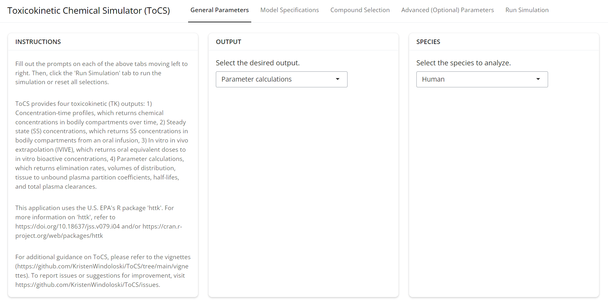{width="100%"}

<br/><br/>

### Model Specifications Tab

As shown in the image below, there are no user selections under the *Dosing* card. Under the *Model* card, we omit the first drop down menu and leave it on *None* as the models described in the *Introduction to ToCS* vignette are not used to calculate parameters. Finally, we select *No* under the second drop down menu under the *Model* card since we do not want the program to simulate chemicals with only in silico generated parameters. The completed tab should look like the image below, and the user can proceed to the next tab.

<br/><br/>

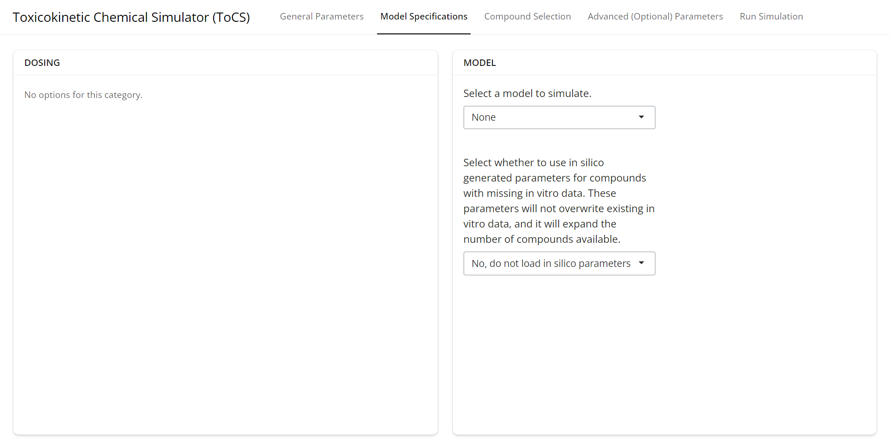{width="100%"}

<br/><br/>

### Compound Selection Tab

Under the *Preloaded Compounds* tab, we search by either compound name or CAS for all nine compounds. All but two compounds (advantame and titanium dioxide) are available, so we select the seven available compounds under the *Preloaded Compounds* tab. Thus, we have to upload the chemical data for advantame and titanium dioxide. So, we copy the SampleCSV file in the *Uploaded Compound File Folder* under the *Instructions* card and enter the appropriate chemical information for each compound, as shown in the table below. See the *Introduction to ToCS* vignette for more information on upload instructions. For the purpose of this example, we use fake chemical data and upload the following csv file (CSV_PCvignette.csv) by clicking *Browse* under the *Uploaded Data* card.

<br/><br/>

```{r echo = FALSE, results='asis'}
library(knitr)
library(kableExtra)
SampleChemsToUpload <- read.csv("Sample CSV Files/CSV_PCvignette.csv")
kable(SampleChemsToUpload, caption = "A csv file with chemical information for advantame and titanium dioxide. Data other than the chemical identifiers and molecular weight (MW) are fictional.") %>%    kable_styling() %>%
  scroll_box(width = "100%")
```

<br/><br/>

Now that all simulation chemicals are uploaded, the final *Compound Selection* tab should look like the image below.

<br/><br/>

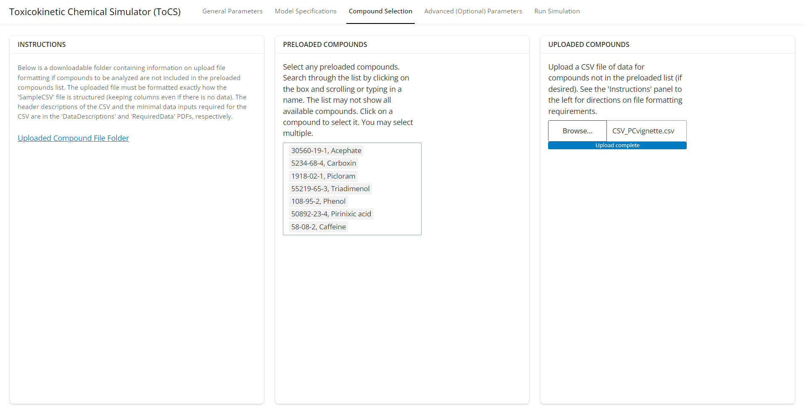{width="100%"}

<br/><br/>

### Advanced (Optional) Parameters Tab

The *Advanced Parameters* tab is much more bare than for other modules, but since we are not going to customize any additional parameters for this example, we leave all inputs as is. The *Advanced Parameters* tab should look like the image below.

<br/><br/>

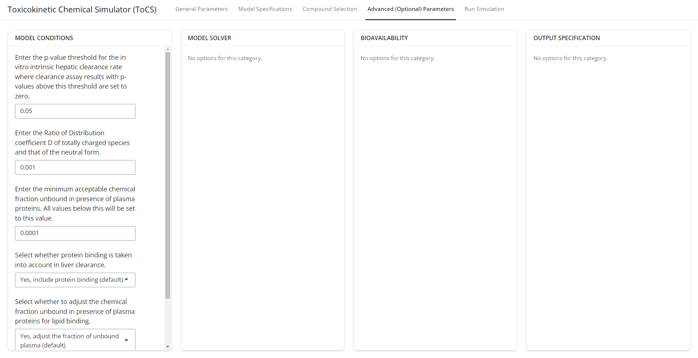{width="100%"}

<br/><br/>

### Run Simulation Tab

Now that all user selections have been made and all of the desired simulation compounds appear under the *Selected Compounds* card, we hit the *Run Simulation* button under the Actions card. The page prior to simulation completion should look like the image below, with five drop downs where results will appear under the *Results* card.

<br/><br/>

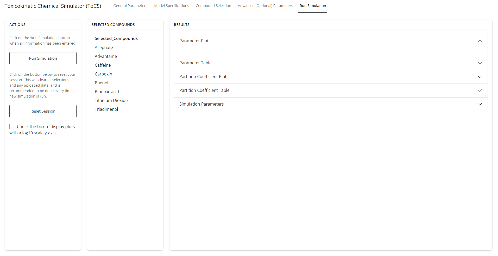{width="100%"}

<br/><br/>

Once the simulation is complete, users will see a group of four plots appear under the *Parameter Plots* tab in the *Results* card. The plots show each compound's elimination rate (1/h, top left), volume of distribution (L/kg BW, top right), half life (h, bottom left), and total plasma clearance (L/h/kg BW, bottom right). The users have the option to download this figure as is using the *Download Figure 1* button. The user's interface should look like the image below.

<br/><br/>

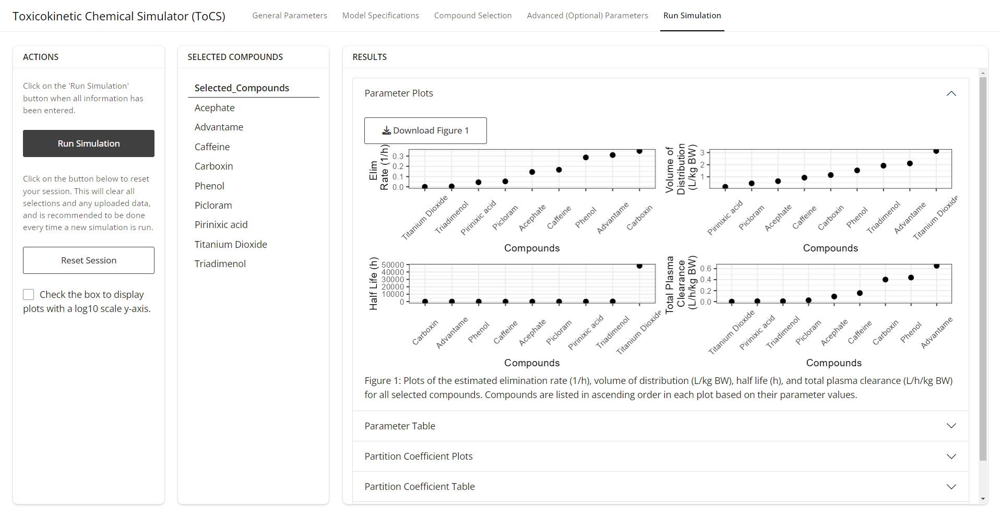{width="100%"}

<br/><br/>

If we wanted to view the plots under this tab using a log10 y-axis, we would check the bottom box under the *Actions* card, and then the user would see the plots in the image shown below which makes it clearer to distinguish the parameter values of smaller magnitudes.

<br/><br/>

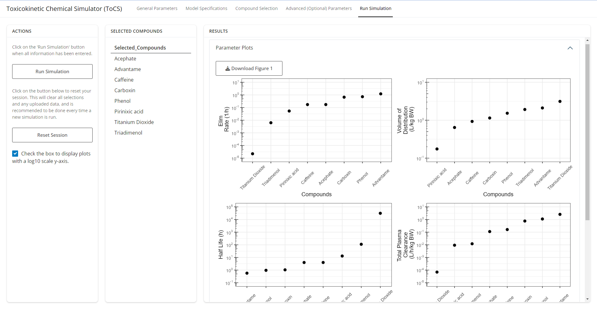{width="100%"}

<br/><br/>

Under the next drop down tab, there is a table of the parameter values from the previous tab. The user has the option to download the table by clicking the *Download Table 1* button. The drop down tab should look like the image below.

<br/><br/>

{width="100%"}

<br/><br/>

Under the third drop down tab, the user should see 13 plots, one per partition coefficient. This compilation of plots is available for download by clicking the *Download Figure 2* button at the top of the tab. The user's plots should look like the image below.

<br/><br/>

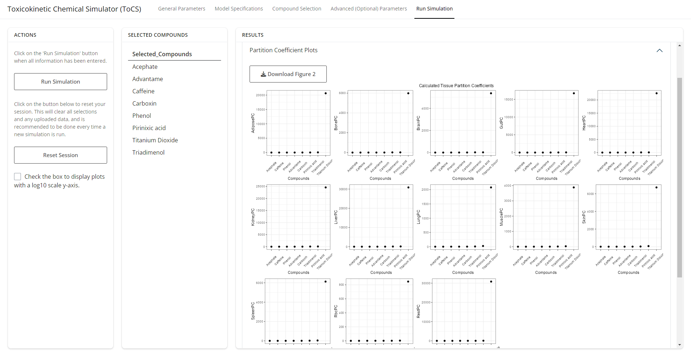{width="100%"}

<br/><br/>

Now as with the first drop down tab, the user can change the scale on the y-axis of the partition coefficient plots to be a log10 y-axis scale in order to easier distinguish the smaller magnitudes. The user can download the partition coefficient plot by clicking the *Download Figure 2* button. The log10 y-axis scale plots should look like the image below.

<br/><br/>

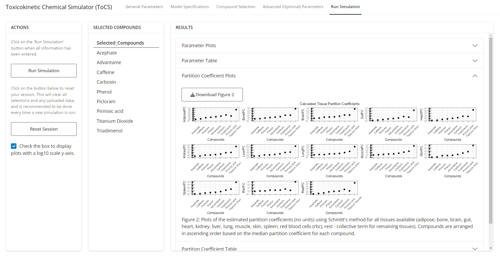{width="100%"}

<br/><br/>

Under the fourth drop down tab is a table of partition coefficients from the plots under the previous tab. Users can download the table of partition coefficients by clicking the *Download Table 2* button. The user's table should look like the image below.

<br/><br/>

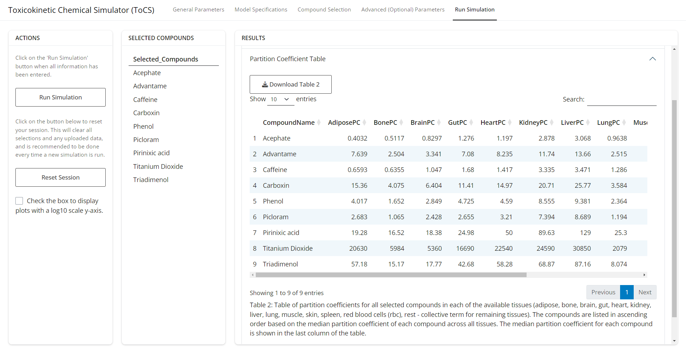{width="100%"}

<br/><br/>

The fifth and final tab offers the user the option to download all of the user parameter selection and chemical information used to generate the simulation. The user can download this information by clicking the *Download Simulation Parameters* button. The user's screen should look like the image below.

<br/><br/>

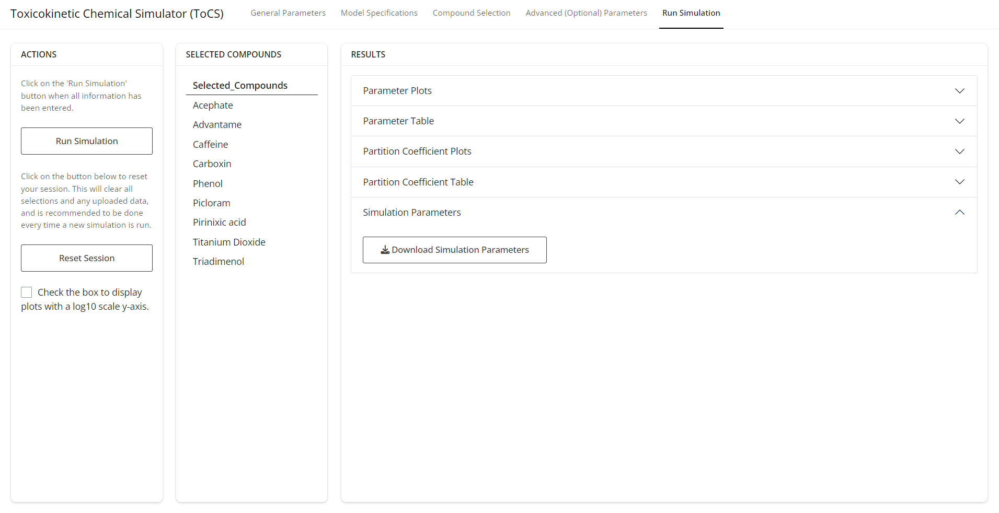{width="100%"}

<br/><br/>

As with other vignettes, we suggest that the user clicks the *Reset Session* button if they want to run another simulation.

## Example 2

For this example, let's say that we want to calculate rat TK parameters for five unknown sample chemicals, where we will not allow chemicals to be included in our selection that only have enough data with the inclusion of in silico parameters. We will also customize several advanced parameters within this example.

### General Parameters Tab

As with the previous example, we select *Parameter calculations* for the first drop down menu under the *Output* card. However, for this example, we select *Rat* for the first drop down under the *Species* card. Then, suppose we want to only use rat in vitro data instead of allowing human data to substitute for missing in vitro rat data, and so we select *No* for the second drop down under the *Species* card. The completed *General Parameters* tab should look like the image below.

<br/><br/>

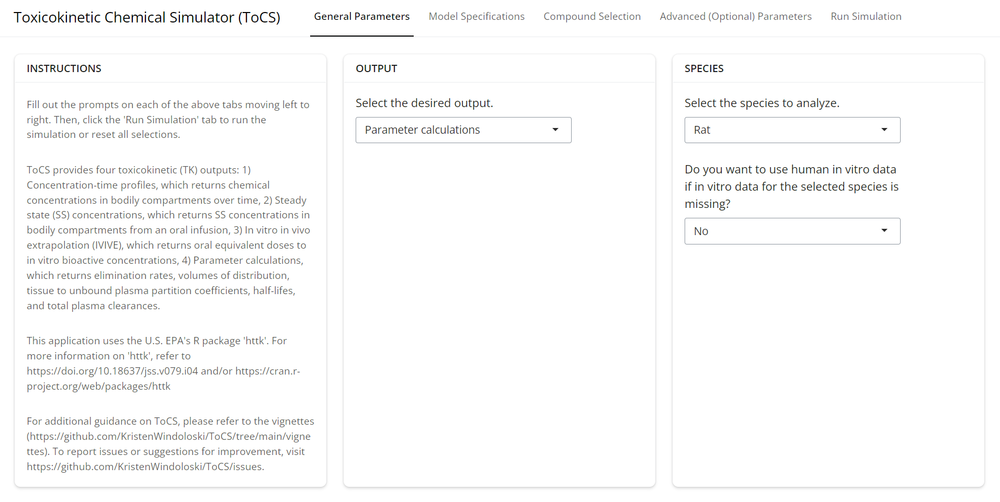{width="100%"}

<br/><br/>

### Model Specifications Tab

Our selections on this page are the same as example 1. The first drop down menu under the *Model* card remains as is and, in the second drop down menu, we select *No* to not include chemical options with in silico generated parameters in place of in vitro data. The *Model Specifications* tab should look like the image below.

<br/><br/>

{width="100%"}

<br/><br/>

### Compound Selection Tab

We select five compounds from the drop down menu under the *Preloaded Compounds* card to simulate:

  - Bisphenol-a (CAS: 80-05-7)
  - Butylparaben (CAS: 94-26-8)
  - Norethindrone (CAS: 68-22-4)
  - Propylparaben (CAS: 94-13-3)
  - Zoxamide (CAS: 156052-68-5)
  
Then, since there are no additional compounds we want to simulate, we advance to the next tab. The completed *Compound Selection* page should look like the image below.

<br/><br/>

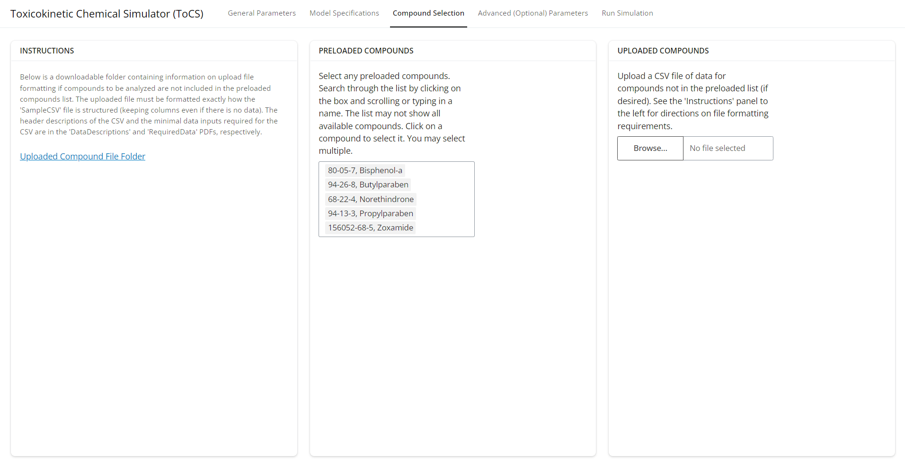{width="100%"}

<br/><br/>

### Advanced Parameters Tab

In this example, we decide to change some of the default values of the advanced parameters under the *Model Conditions* card. First, suppose that we want to lower the p-value threshold for the in vitro intrinsic hepatic clearance rate. Thus, we set the first box to *0.01* instead of *0.05*. Then, under the fourth drop down box, suppose that we want to not include protein binding when accounting for liver clearance. Therefore, we select *No, do not include protein binding*. Then finally, suppose we do not want to adjust the fraction unbound in the presence of plasma proteins for lipid binding. Therefore, we select *No, do not adjust the fraction of unbound plasma*. The completed *Advanced Parameters* tab should look like the two images below.

<br/><br/>

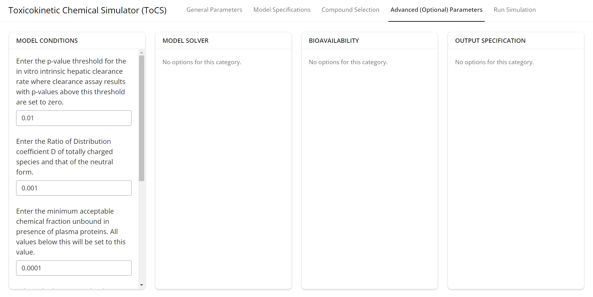{width="100%"}

<br/><br/>

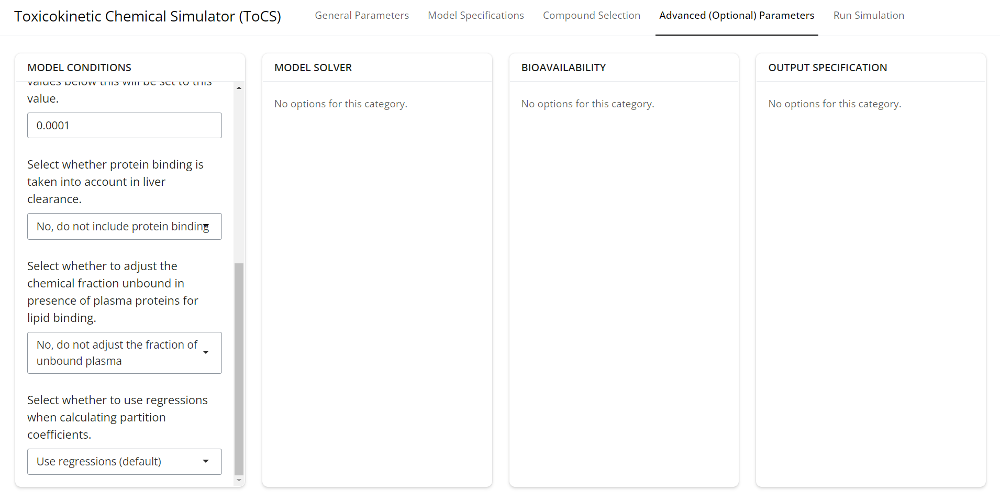{width="100%"}

<br/><br/>

### Run Simulation Tab

Now that all user selections have been made and all compounds appear under the *Selected Compounds* card, we can hit the *Run Simulation* button under the *Actions* card to initiate the simulation. Below is an image of what the *Run Simulation* tab should look like once the simulation is complete. The plots show each compound's elimination rate (1/h, top left), volume of distribution (L/kg BW, top right), half life (h, bottom left), and total plasma clearance (L/h/kg BW, bottom right). Users have the option to download the figure by clicking the *Download Figure 1* button.

<br/><br/>

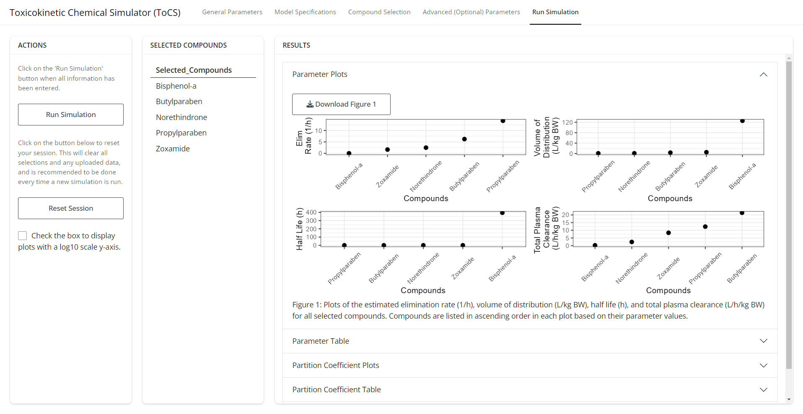{width="100%"}

<br/><br/>

Since it is impossible to tell the volume of distribution and half life values for four of the five compounds in the plot above, we change the y-axis scale to be a log10 y-axis by clicking the checkbox under the *Actions* tab. Then, the plots should look like the image below, which allows the user to clearly see the magnitude of all parameter predictions.

<br/><br/>

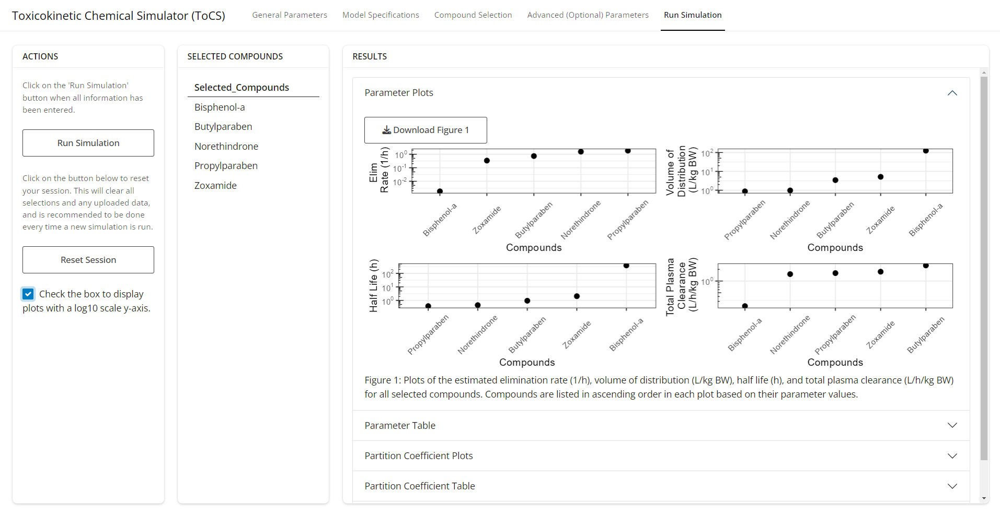{width="100%"}

<br/><br/>

Under the second drop down menu and shown in the image below, the parameter values from the plots shown in the previous tab are stated in a table. Users can download this table by clicking the *Download Table 1* button at the top of the tab.

<br/><br/>

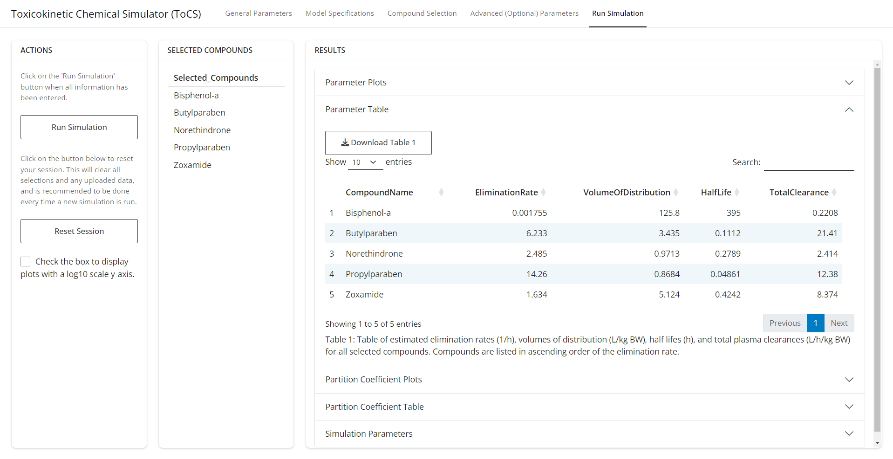{width="100%"}

<br/><br/>

Under the third drop down menu in the *Results* card are 13 partition coefficient plots with one value per compound, as shown in the image below. Users can download these plots by clicking the *Download Figure 2* button at the top of the tab.

<br/><br/>

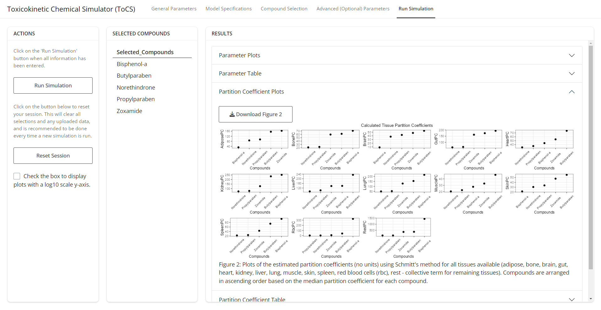{width="100%"}

<br/><br/>

As with the plots under the first results tab, users can transform the scale of the y-axis to be a log10 scale by checking the box under the *Actions* card. This will produce the image shown below and give the user a better visual understanding of how the partition coefficients compare to one another.

<br/><br/>

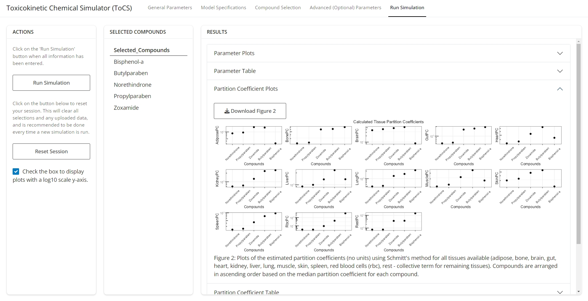{width="100%"}

<br/><br/>

Under the fourth drop down menu (shown in the image below), the parameter values from the plots shown in the previous tab are stated in a table. Users can download this table by clicking the *Download Table 1* button at the top of the tab.

<br/><br/>

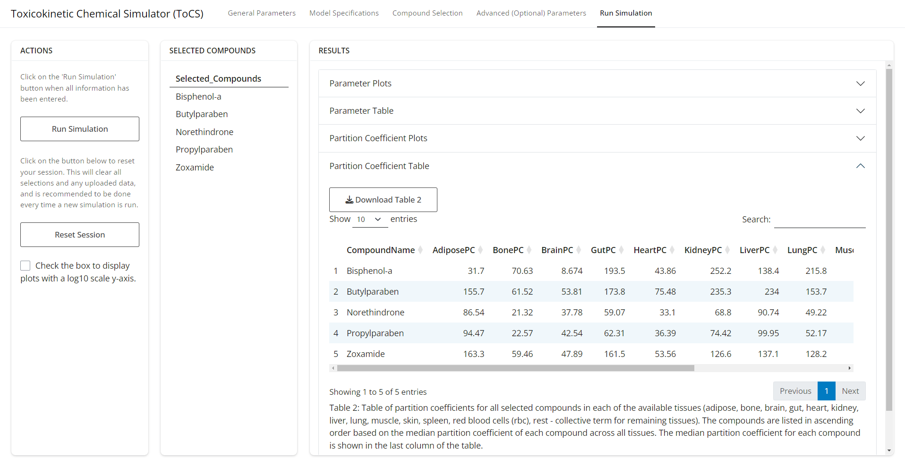{width="100%"}

<br/><br/>

The final drop down tab under the *Results* card gives the user the option to download all model parameters and chemical information for all 5 chemicals.

<br/><br/>

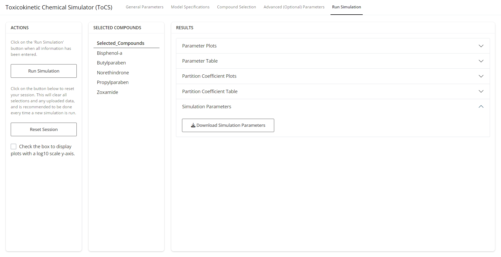{width="100%"}

<br/><br/>

As with the previous example, we suggest that the user clicks the *Reset Session* button if they want to run another simulation.
