```{r, include = FALSE}
knitr::opts_chunk$set(
  collapse = TRUE,
  comment = "#>",
  warning = FALSE, 
  message = FALSE
)
```

If you have not already read the *Introduction to the ToCS App* vignette, it is highly recommended to do so to get a general idea of the app's layout and obtain a detailed description of common user inputs across all output modules. Users should also review the ToCS README file to setup ToCS if they have not accessed the app yet. This vignette assumes that you have access the ToCS app GUI already.

<br/><br/>

# Introduction

This vignette provides three examples that use the ToCS app to generate concentration-time profiles, each example with different parameters selected. To begin, open the app by using any of the methods described in the README file. You have correctly accessed the app if your screen looks like the image below.

<br/><br/>

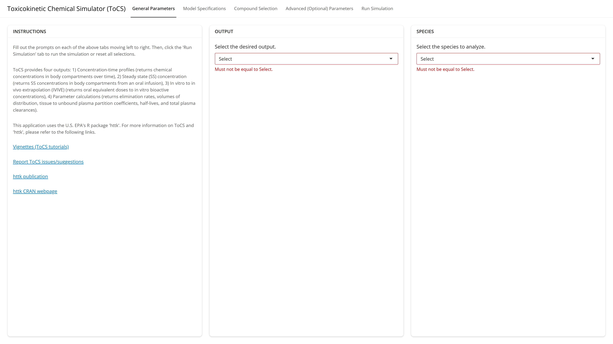{width="100%"}

<br/><br/>

# Model States

Before jumping into several examples, we define the output states that users will see in plots and tables generated by ToCS for this module. Below, we list the model chosen and all of its output states.

- 1compartment
  - Agutlumen = Amount of chemical in the gut lumen
  - Ccompartment = Plasma concentration of chemical in main absorption compartment
  - Ametabolized = Amount of chemical metabolized by the main compartment
  - AUC = Area under the curve of the plasma concentration
- 3compartment
  - Aintestine = Amount of chemical in the intestine
  - Cliver =  Concentration of chemical in the liver
  - Csyscomp = Concentration of chemical in the systemic compartment
  - Cplasma = Concentration of chemical in the plasma
  - Atubules = Amount of chemical excreted by the systemic compartment through the tubules
  - Ametabolized = Amount of chemical metabolized by the liver
  - AUC = Area under the curve of plasma concentration
- pbtk
  - Agutlumen = Amount of chemical in the gut lumen
  - Cgut = Concentration of chemical in the gut
  - Cliver = Concentration of chemical in the liver
  - Cven = Concentration of chemical in veins
  - Clung = Concentration of chemical in the lung
  - Cart = Concentration of chemical in arteries
  - Crest = Concentration of chemical in rest of body
  - Ckidney = Concentration of chemical in kidney
  - Cplasma = Concentration of chemical in plasma
  - Atubules = Amount of chemical excreted by the kidney through the tubules
  - Ametabolized = Amount of chemical metabolized by the liver
  - AUC = Area under the curve of plasma concentration
- fetal_pbtk
  - All outputs in the pbtk model for maternal concentrations and amounts plus:
  - Cadipose = Concentration of chemical in adipose tissue
  - Rblood2plasma = Dynamic maternal ratio of blood to plasma (unitless)
  - fAUC = Fetal area under the curve of the fetal plasma concentration
  - Cplacenta = Concentration of chemical in placenta
  - Cfliver = Concentration of chemical in fetal liver
  - Cfven = Concentration of chemical in fetal veins
  - Cfart = Concentration of chemical in fetal arteries
  - Cfgut = Concentration of chemical in fetal gut
  - Cflung = Concentration of chemical in fetal lung
  - Cfrest = Concentration of chemical in fetal rest of body
  - Cfthyroid = Concentration of chemical in fetal thyroid
  - Cfkidney = Concentration of chemical in fetal kidney
  - Cfbrain = Concentration of chemical in fetal brain
  - Cfplasma = Concentration of chemical in fetal plasma
  - Rfblood2plasma = Dynamic fetal ratio of blood to plasma (unitless)
- full_pregnancy
  - All outputs in the fetal_pbtk model for plus:
  - Cthyroid = Concentration of chemical in maternal thyroid
  - Aconceptus = Amount of chemical in conceptus (embryo)
  - Cconceptus = Concentration of chemical in conceptus (embryo)
  
Amount outputs have units of umol, while concentration outputs are in uM. The area under the curve outputs have units uM*days. Any other units are specified above when defined. The user can also check the figure captions for units. If the user wants further details on the models and their formulations, they are encouraged to check out the httk documentation [here] (https://cran.r-project.org/web/packages/httk/index.html).

<br/><br/>

# Example 1

Let's say we want to run a simulation that outputs human concentration-time profiles over the course of five days for four compounds: Abamectin (CAS: 71751-41-2), Bisphenol-A (CAS: 80-05-7), Cyanazine (CAS: 21725-46-2), and Dimethoate (CAS: 60-51-5). The simulation will be for a single 5 mg/kg oral exposure of each compound and use the PBTK model without including in silico generated parameters in place of in vitro data.

### General Parameters Tab

Since the main output we want is concentration-time profiles, we select *Concentration-time profiles* from the drop down menu under the *Output* card. Under the *Species* card, we select *Human* species. Thus, the completed first tab should look like the page below.

<br/><br/>

{width="100%"}

<br/><br/>

Now, we move on to the *Model Specifications* tab.


### Model Specifications Tab

On the *Model* card, we select *pbtk* for the pbtk model on the first drop down menu. Since we do not want to use in silico generated parameters for this simulation, we select *No* for the second drop down menu under the *Model* card. Finally, since we only want to run our simulation for five days, we edit the bottom box in the *Model* card to be 5 instead of the default value of 10. On the *Dosing* card, we leave the first two drop down menus as their default values. For the dosing frequency, we select *Single Dose* from the drop down menu. This prompts the appearance of a textbox where we can input the number of mg/kg to be administered. We change its value to 5 since we want a single 5 mg/kg exposure. Now the *Model Specifications* tab is completed and should look like the image below, so we can proceed to the *Compound Selection* tab.

<br/><br/>

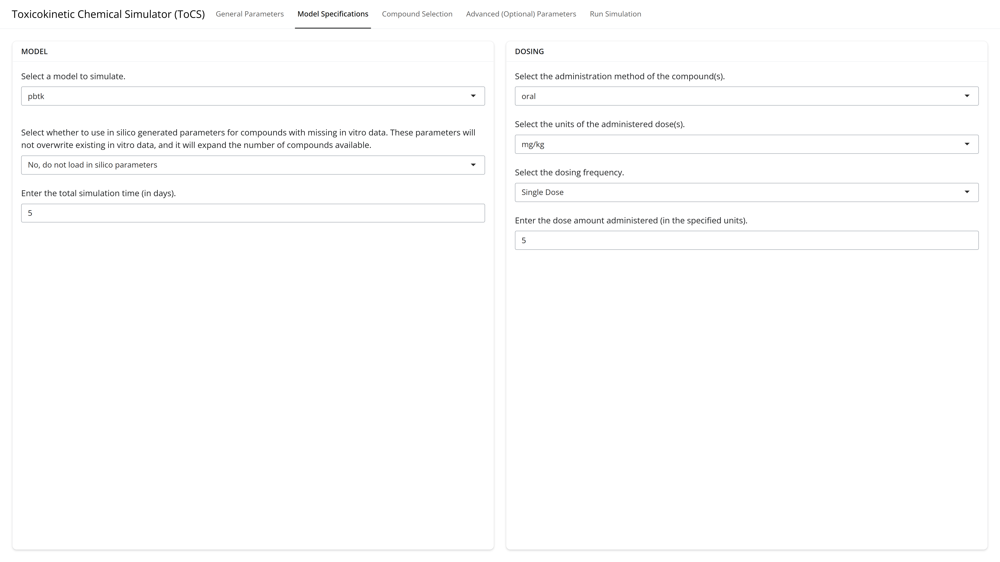{width="100%"}

<br/><br/>

### Compound Selection Tab

Since we want to simulate four compounds (abamectin, bisphenol-a, cyanazine, and dimethoate), we keep the first drop menu in the *Preloaded Compounds* card on *Choose from all available chemicals* selection and try searching the second drop down menu to see if the program is able to simulate those chemicals with the current data in httk. To see the available compounds, click on the empty box in the center column. By either scrolling or typing in the textbox, we see that the names of all four compounds are also available, so we select those. Since all of the compounds we need are available, we do not need to upload a CSV file under the *Uploaded Data* card and leave it untouched. Then, we proceed to the next tab. 

<br/><br/>

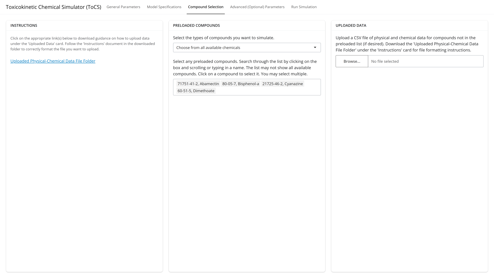{width="100%"}

<br/><br/>


### Advanced (Optional) Parameters Tab

For simplicity of this example, we will leave all selections and inputs on this tab alone and proceed to the next and final tab.

### Run Simulation Tab

All input selections are complete and the correct compounds appear under the *Selected Compounds* card, as shown in the image below. Therefore, we hit the *Run Simulation* button under the *Actions* card so ToCS can compute the solution. The output will appear in the *Results* window when complete. Depending on the number of compounds selected to simulate, the results may take several seconds to populate.

<br/><br/>

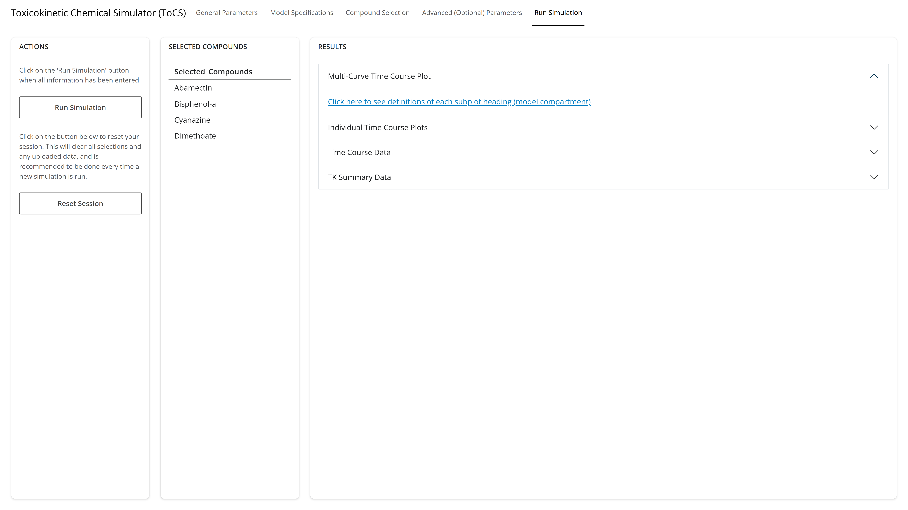{width="100%"}

<br/><br/>

The image below shows the first drop down in the *Results* card once the simulation is complete. The user sees the complete time course curves of all four chemicals in each model compartments overlaying each other. The legend for the figure is located in the bottom right corner, and a figure description describing the y-axis of each subplot is located below the figure. The user also has the option to download this figure by clicking *Download Figure 1*.

<br/><br/>

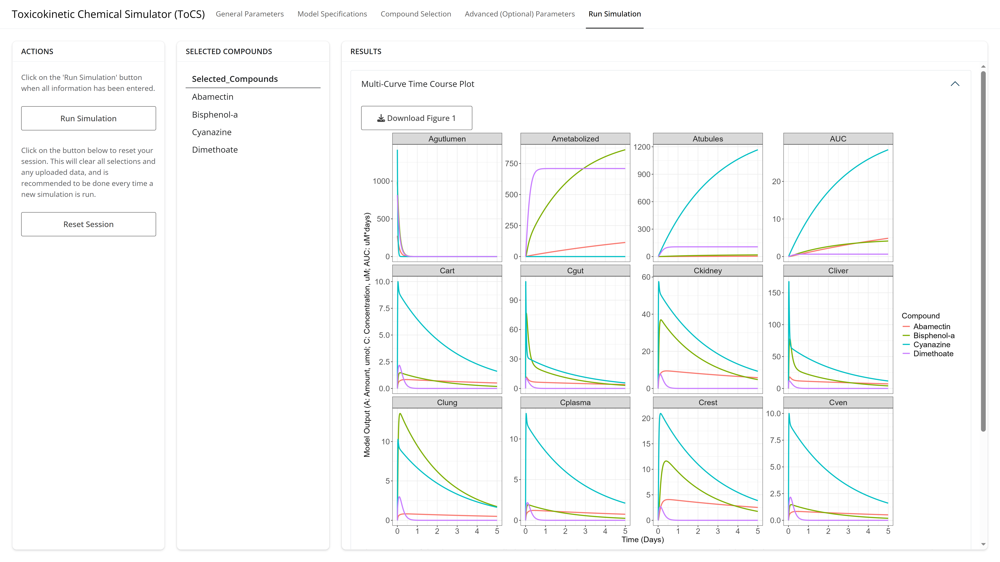{width="100%"}

<br/><br/>

The second drop down in the *Results* card, as seen below, shows the user the same plots as seen in the first drop down tab but with each compound on a separate plot. The user has the option to download all individual plots as a zip file. A figure caption is also located under the very last plot in this tab.

<br/><br/>

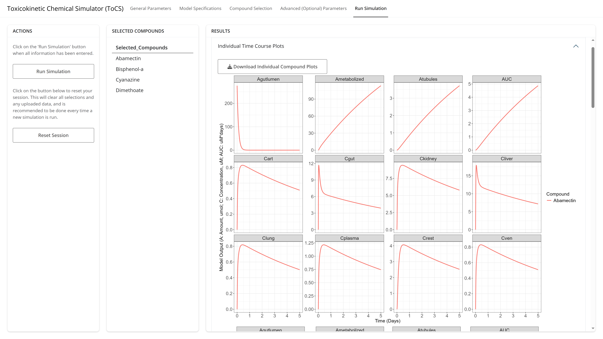{width="100%"}

<br/><br/>

The third drop down in the *Results* card allows the user to download the time course simulation data that was used to generate the plots in the two drop downs above. The user can also download all of the inputted simulation parameters as well as the chemical data used in the simulations. The interface with these two download buttons in shown below. Opening the bottom drop down in the *Results* card shows a toxicokinetic summary including the Tmax (time to maximal concentration), Cmax (maximal concentration), and AUC (area under the curve) of all simulated compounds within each model compartment. The table is available for download if the user clicks *Download Table 1*.

<br/><br/>

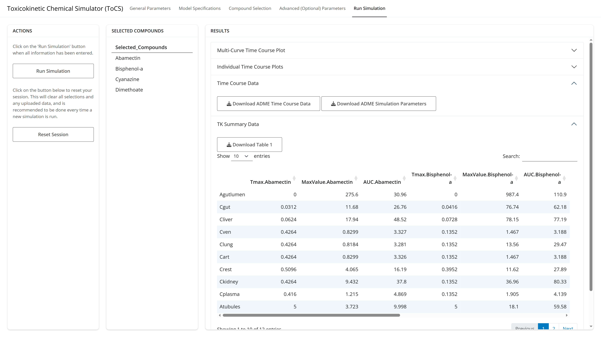{width="100%"}

<br/><br/>


If we wanted to run another simulation, we would click the *Reset Session* button under the *Actions* card, which would clear all parameter inputs and simulations and return the interface to the *General Parameters* tab.

<br/><br/>


# Example 2

Let's say we want to run a simulation that outputs rat concentration-time profiles over the course of three days for five compounds: Valproic Acid (CAS: 99-66-1), Benzoic Acid (CAS: 65-85-0), Ethanol (CAS: 64-17-5), and two fictional chemicals: Chemical1 (CAS: 111-11-1), and Chemical2 (CAS: 222-22-2). The simulation will be for three oral exposures a day every eight hours of 2 mg/kg each for each compound. We will use the 3-compartment model without including in silico generated parameters for missing in vitro data.

### General Parameters Tab

As with example 1, we select *Concentration-time profiles* as the desired output under the *Output* card. This time, however, we select *Rat* species for the first drop down under the *Species* card. Let's say that, in this example, we only want to use rat in vitro data instead of using human in vitro data for compounds missing rat data. Thus, we select *No* for the second drop down menu under the *Species* card. The first tab should now look like the image below.

<br/><br/>

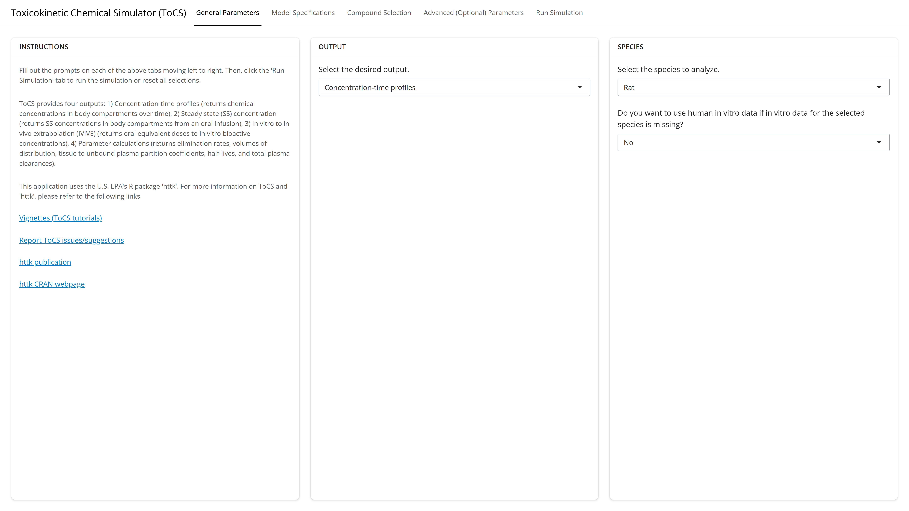{width="100%"}

<br/><br/>

### Model Specifications Tab

On the *Model* card, we select *3compartment* model under the first drop down menu. For the second drop down menu, we select *No* since we do not want to use in silico generated parameters. Finally, we enter *3* in the final box under the *Model* card since we want to run the simulation for three days. On the *Dosing* card, we again leave the first two drop down menus at their default selections. For the dosing frequency (third) drop down menu, we select *Multiple Doses*. A fourth drop down menu will then appear asking whether we want the multiple doses to be evenly distributed throughout the day. Since we want to administer a 2 mg/kg dose every 8 hours, we select *Yes* from the drop down menu. Finally, two additional user options appear. The first one asks the user to specify the amount of chemical exposure per administration, and so we enter 2 into the box. The second one is a slider that has the user specify the frequency of the dose, and so we move the slider to 8 hours. Therefore, the final interface of the *Model Specifications* tab should look like the image below.

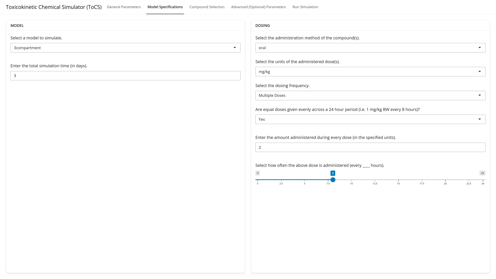{width="100%"}

### Compound Selection Tab

We first try to search for the compounds we desire to simulate by keeping the first drop menu in the *Preloaded Compounds* card on *Choose from all available chemicals* and then searching through the second drop down menu. Typing in the chemical names or CAS numbers shows that three of the five desired chemicals (valproic acid, benzoic acid, ethanol) are present on the preloaded compounds list and two chemicals are not (Chemical1 and Chemical2). Therefore, we select valproic acid, benzoic acid, and ethanol on the *Preloaded Compounds* card and will have to upload the remaining two compounds under the *Uploaded Data* card. To get the chemical information for Chemical1 and Chemical2 into the program, we copy the *SampleCSV.csv* file in the *Uploaded Physical-Chemical File Folder* under the *Instructions* card and enter the appropriate chemical information for each compound. See the *Introduction to ToCS* vignette for more information on upload instructions. For the purpose of this example, we use fictional chemical data and upload the following csv file by clicking *Browse* under the *Uploaded Data* card.

<br/><br/>

```{r echo = FALSE, results='asis'}
library(knitr)
library(kableExtra)
SampleChemsToUpload <- read.csv("CSVs/CSV_vignettes.csv")
kable(SampleChemsToUpload, caption = "A csv file with two fictional chemicals.") %>%    kable_styling() %>%
  scroll_box(width = "100%")
```

<br/><br/>

Once we have the three compounds selected under the *Preloaded Compounds* card and the two compounds uploaded under the *Uploaded Data* card (with the csv file name CSV_vignettes.csv), we then proceed to the next tab. The final *Compound Selection* tab should look like the image below.

<br/><br/>

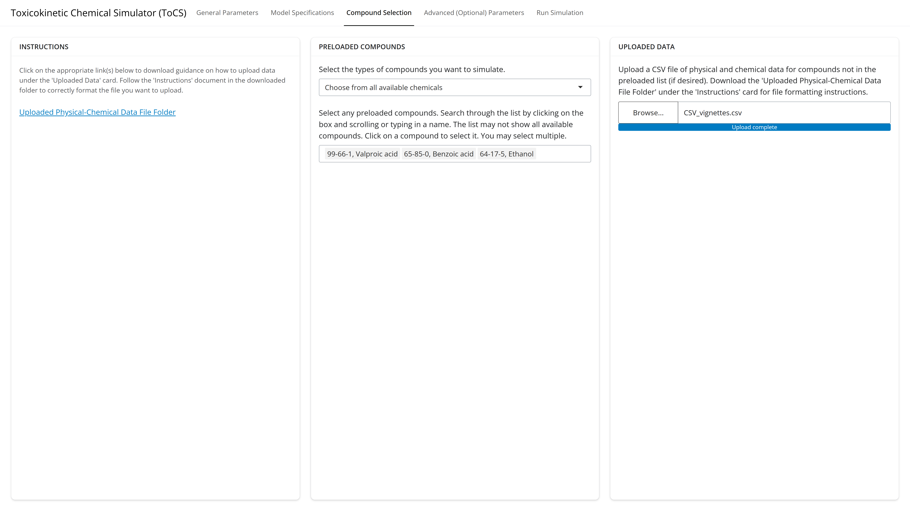{width="100%"}

<br/><br/>

### Advanced (Optional) Parameters Tab

Suppose that we want to customize parameters other than just the basic simulation information needed. For this example, let's say we want to change the starting amount of each compound in the gut lumen and gut to be 10 umol instead of 0 umol. So, we select *Yes, enter my own initial amounts* under the first drop down menu in the *Model Conditions* card. Consequently, an additional seven text boxes appear under this drop down. Since we only want to change the amounts in the gut lumen and gut, we change the first two text boxes to be 10 instead of 0. There are no other changes we want to make, so we leave the remaining selections as is and proceed to the final tab, *Run Simulation*. The completed advanced parameters page should look like the image below.

<br/><br/>

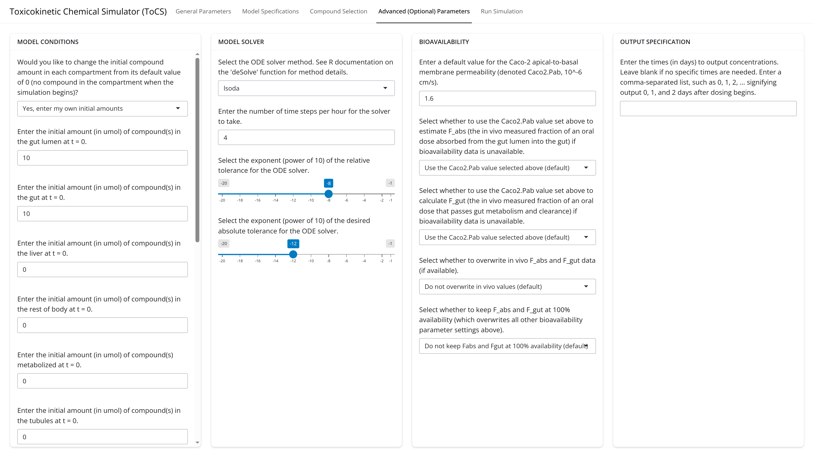{width="100%"}

<br/><br/>

### Run Simulation Tab

Now, we've filled out all simulation information and the correct compounds appear under the *Selected Compounds* card. Thus, we click the *Run Simulation* button under the *Actions* card. The image of the completed simulation is shown below. The first tab illustrates the time course plots of all five compounds for each model compartment. The user has the option to download the plot by clicking *Download Figure 1*.

<br/><br/>

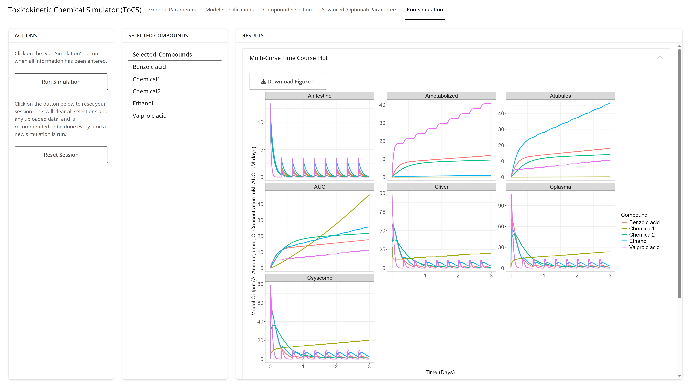{width="100%"}

<br/><br/>

By closing the *Multi-Curve Time Course Plot* drop down, we view the *Individual Time-Course Plots* drop down and see the same plots as shown in the drop down above but all on a separate plots (one figure per compound). The user can download the individual plots by clicking the *Download Individual Compound Plots* button, where all the plots will download as a zip file.

<br/><br/>

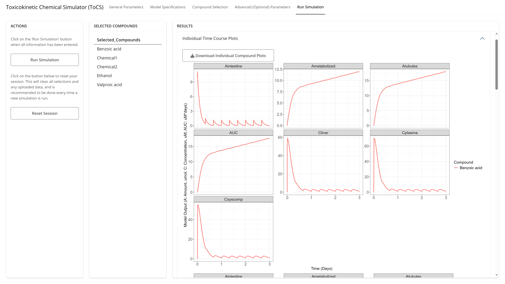{width="100%"}

<br/><br/>

The final below shows the user's option to download the simulation results as well as the simulation parameters used to generate the solution. The fourth drop down tab shows a table of simulation summary statistics for each compound in each model compartment. The user has the option to download the table by clicking the *Download Table 1*.

<br/><br/>

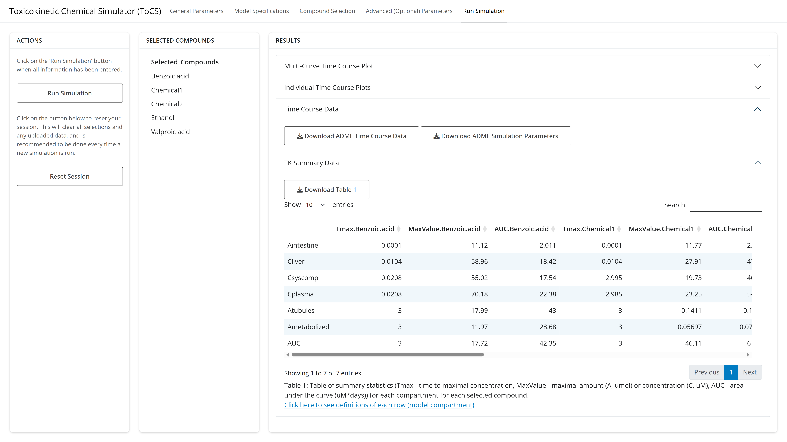{width="100%"}

<br/><br/>

As with Example 1, we suggest that the user clicks the *Reset Session* button under the *Actions* card if the user wishes to run a new simulation.


## Example 3

Let's say we want to run a simulation that outputs rat concentration-time profiles for two days for three compounds: Docusate sodium (CAS: 577-11-7), Phenol (CAS: 108-95-2), and Potassium Benzoate (CAS: 582-25-2). The simulation will be for three oral exposures a day, but the exposures will happen at hours 0, 6, and 12 every day and will be 1 mg/kg each at hours 0 and 6 and 0.2 mg/kg at hour 12. We will use the 1-compartment model and include compounds with in silico generated parameters in place of missing in vitro data. We would like the output at every hour during the simulation.

### General Parameters Tab

As with the previous examples, we select *Concentration-time profiles* as the desired output under the *Output* card. As with example 2, we select *Rat* species for the first drop down under the *Species* card. Now, since we are okay with substituting human in vitro data for compounds missing rat in vitro data, we select *Yes* for the second drop down menu under the *Species* card. The first tab should now look like the page below.

<br/><br/>

{width="100%"}

<br/><br/>

### Model Specifications Tab

Under the *Model* card, we select *1compartment* for the first drop down menu. For the second drop down menu, we select *Yes* since we want to include compounds with in silico generated parameters (hepatic clearance, fraction unbound, caco-2) into the compound list. Finally, we enter *2* into the last box under the *Model* card since we want to run the simulation for two days. Under the *Dosing* card, we keep the first two drop downs on their default values. Under the third drop down, we select *Multiple Doses* since we want to give three doses per day. Then, since the doses we want to give are not evenly distributed throughout the day, we select *No* for the resulting fourth drop down menu. Finally, a fifth box appears where we will enter our dosing regime. We enter all of the times (in days) we want to administer the compounds first, then list the amount of compound at each dosing time directly after. Since we want to administer the compounds at hours 0, 6, and 12 each day for two days, the first part of the list we enter is *0, 0.25, 0.5, 1, 1.25, 1.5*. Then, the second part of the list is comprised of the dosing amounts, which are 1 mg/kg for the first two doses of the day and then 0.2 mg/kg for the last dose of each day, so we enter *1, 1, 0.2, 1, 1, 0.2* as the second part of the list. The completed *Model Specification* card should appear the same as the image below.

<br/><br/>

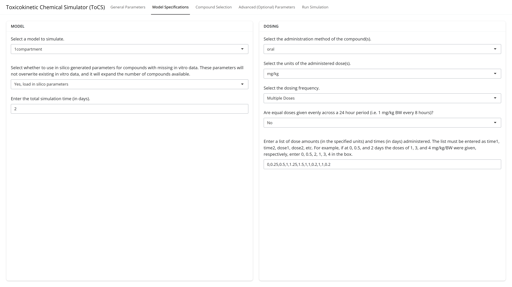{width="100%"}

<br/><br/>

### Compound Selection Tab

Because we are loading all in silico generated parameters into ToCS, the *Preloaded Compounds* card will take a few moments to load. When it does, we keep the first drop down menu in the *Preloaded Compounds* card on *Choose from all available chemicals* selection and then type in the compound names or CAS numbers for each compound into the second search bar, where we can select all three compounds. The completed *Compound Selection* tab should look like the image below.

<br/><br/>

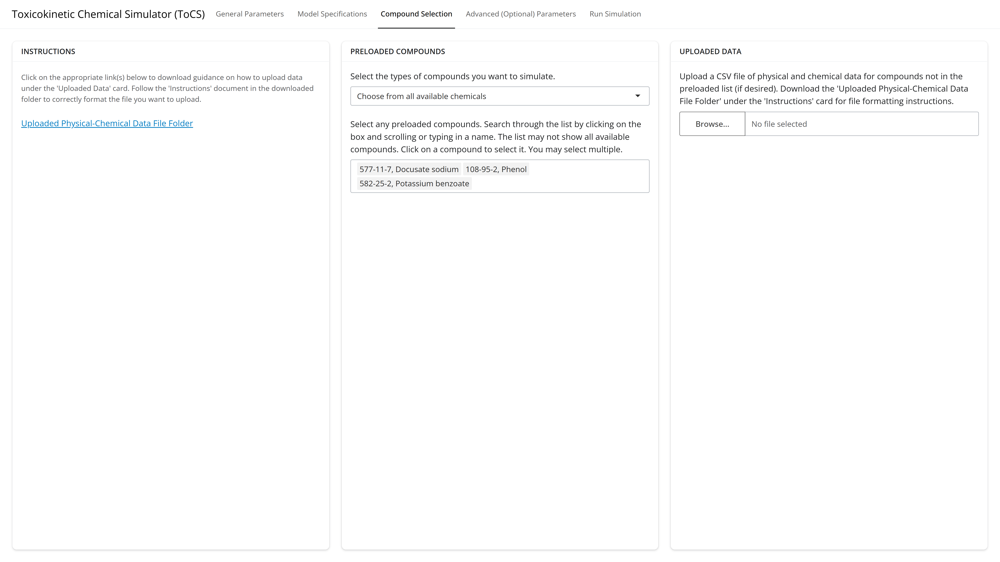{width="100%"}

<br/><br/>

Note that if under the *General Parameters* tab we selected *No* for using human in vitro data in place of missing rat in vitro data, then docusate sodium and potassium benzoate would not be available for simulation since they do not have rat in vitro data.

### Advanced (Optional) Parameters Tab

Since we want to output the solution at every hour, we add a list of output times (in days) to the textbox under the *Output Specification* card on the right of the page. Each time should be separated by a comma, and we can enter times as either whole numbers, decimals, or fractions. Since there are no other customizations we want to make, the completed *Advanced Parameters* tab should look like the image below.

<br/><br/>

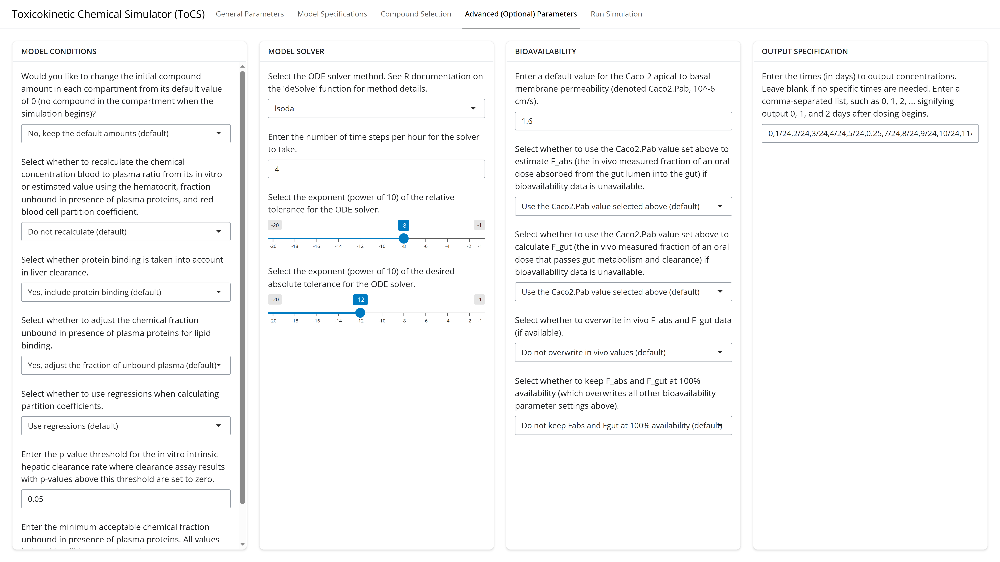{width="100%"}

<!-- 0,1/24,2/24,3/24,4/24,5/24,0.25,7/24,8/24,9/24,10/24,11/24,0.5,13/24,14/24,15/24,16/24,17/24,0.75,19/24,20/24,21/24,22/24,23/24,1,25/24,26/24,27/24,28/24,29/24,1.25,31/24,32/24,33/24,34/24,35/24,1.5,37/24,38/24,39/24,40/24,41/24,1.75,43/24,44/24,45/24,46/24,47/24,2 -->

<!-- 0,0.25,0.5,1,1.25,1.5,1,1,0.2,1,1,0.2 -->

<br/><br/>


### Run Simulation Tab

Now that all previous tabs are completed and the three compounds we want to simulate are shown under the *Selected Compounds* card, so we hit *Run Simulation* under the *Actions* card. When the simulation is complete, it should show the image below. This shows all three simulated compounds overlaying each other for each model compartment with the solution plotted for the times we specified on the previous tab (every hour). The user has the option to download the figure by clicking the *Download Figure 1* button at the top of the drop down menu.

<br/><br/>

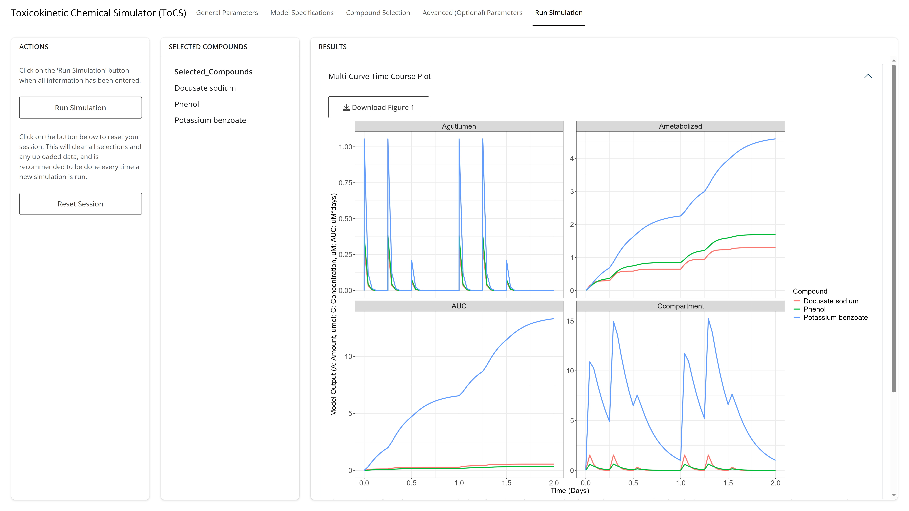{width="100%"}

<br/><br/>

Below, we see the results for the individual time course plots drop down menu. The user has the option to download all indvidual plots as a zip file by clicking the *Download Individual Time Course Plots* button.

<br/><br/>

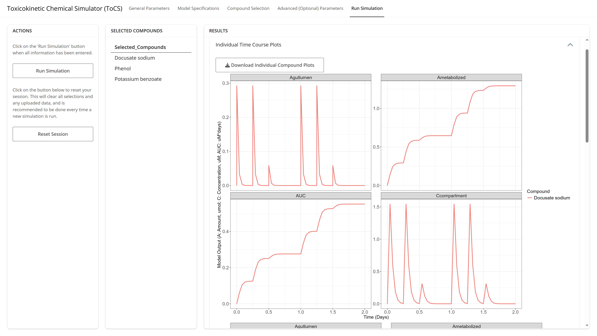{width="100%"}

<br/><br/>

The two final tabs shown in the image below give the user the options to download the outputted simulation data, the simulation parameters, and a toxicokinetic summary including Tmax, Cmax, and AUC data for each compound within each model compartment.

<br/><br/>

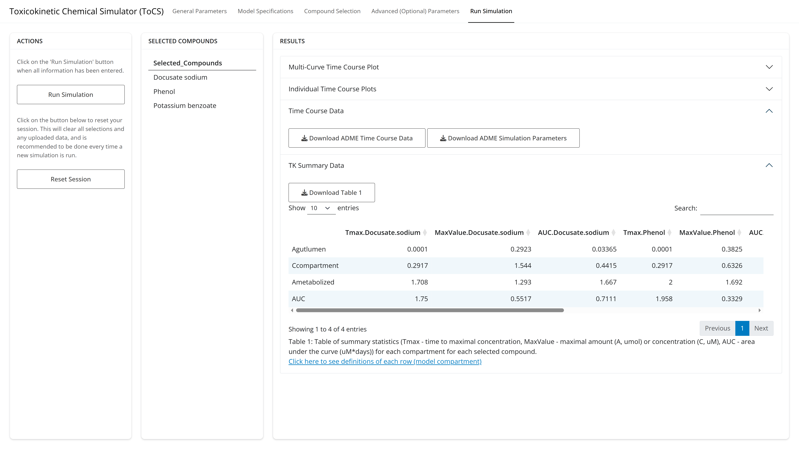{width="100%"}

<br/><br/>

As with previous examples, we suggest that the user clicks the *Reset Session* button under the *Actions* card if the user wishes to run a new simulation.
