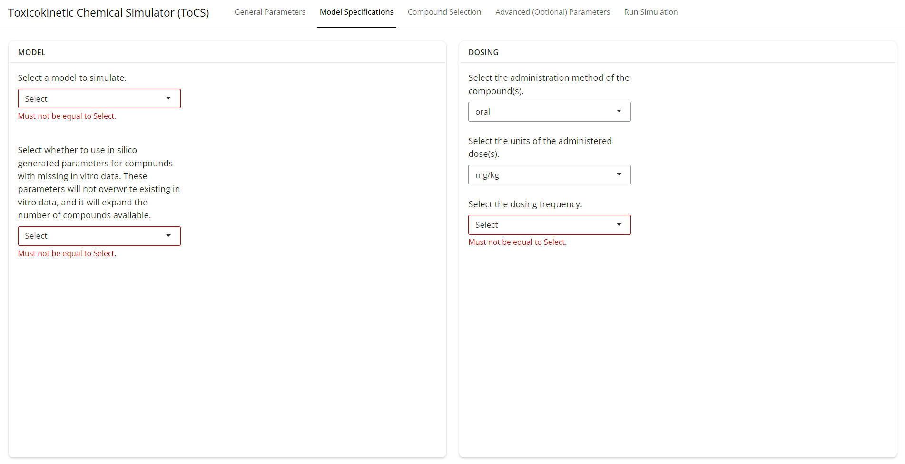
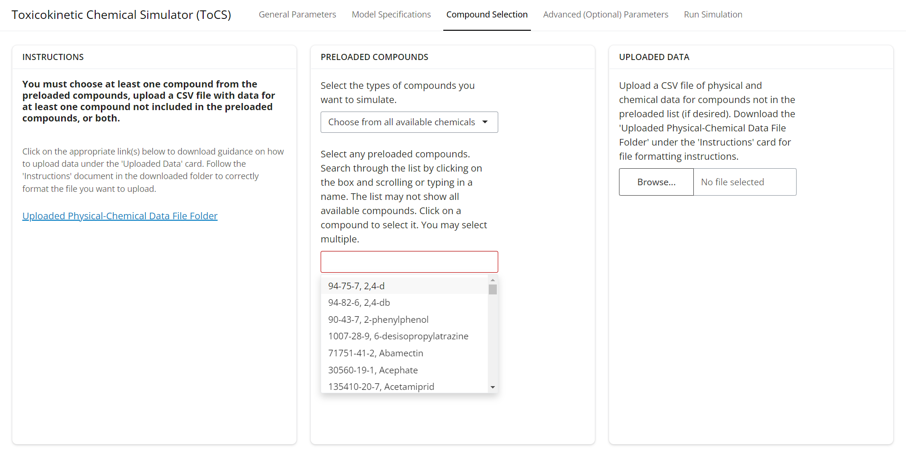
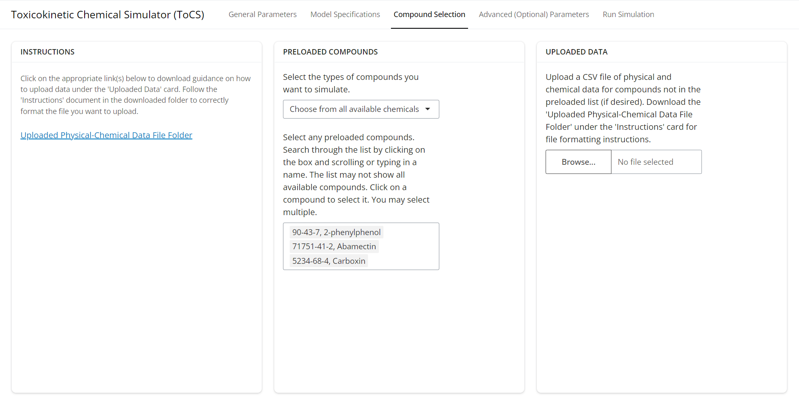
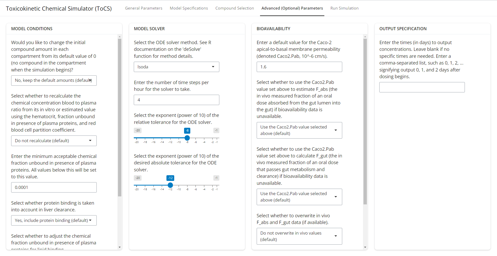
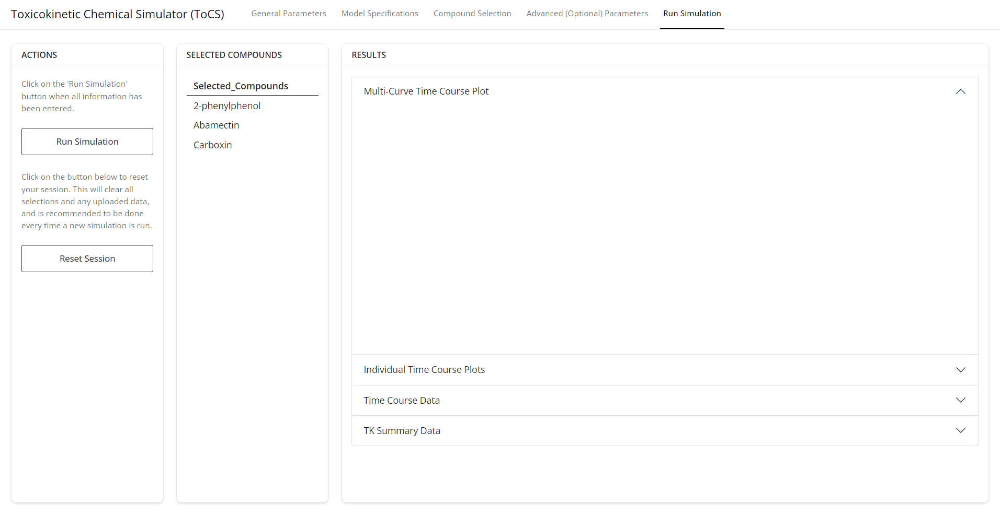
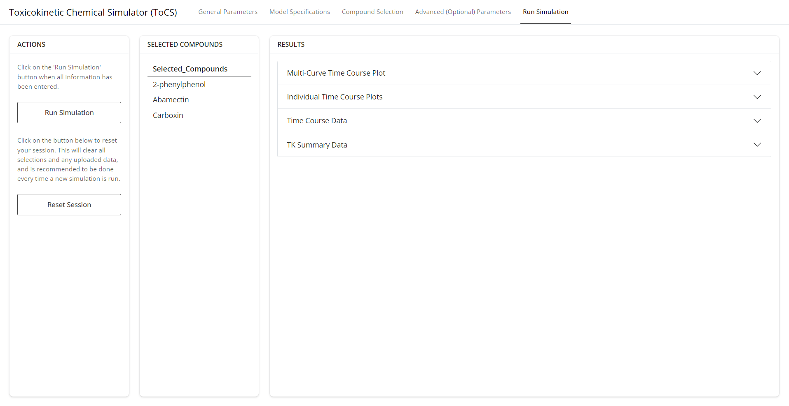

---

```{r, include = FALSE}
knitr::opts_chunk$set(
  collapse = TRUE,
  comment = "#>",
  message = FALSE,
  warning = FALSE
)
```


This vignette provides an introduction to the ToCS graphical user interface (GUI). Here, we describe what the app is, its general layout and common features, and general use advice.

### App Description and Purpose

ToCS is designed to be an easy to use computational tool that generates toxicokinetic information based on little chemical data for user-selected compounds. The app is built using the U.S. EPA's high-throughput toxicokinetics (httk) R package (https://cran.r-project.org/web/packages/httk/index.html), and provides a format to run many the package's main functions without the need to know R. The interface offers a vast majority of the input parameter customizations that can be made to the httk functions, so users of ToCS can either only provide the basic simulation information needed or do a deep dive into customization of model parameters.

While other GUIs that utilize httk have been created (Integrated Chemical Environment (ICE), https://ice.ntp.niehs.nih.gov/), ours is unique in that it 

- Contains a complete pregnancy model from conception to birth (using httk's solve_full_pregnancy function)
- Calculates the area under the curve (AUC) and time to maximum concentration for all model compartments
- Offers computation of analytical steady state concentrations and oral equivalent doses (OEDs) for all model and other tissue compartments, not just plasma
- Predicts the bioactivity exposure ratio (BER) and plots the OEDs against exposure estimates given user-uploaded chemical exposure data, which can be used to prioritize chemicals for further risk assessment
- Provides estimates of TK parameters not only including half-lives but also total plasma clearances, volumes of distribution, elimination rates, and partition coefficients
- Estimates the number of days it takes for compounds to reach plasma steady state
- Allows for further customization of simulations beyond basic model parameters
- Utilizes the most recent httk version (2.6.1)
- Allows for non-uniform chemical exposure (dosing), which can be beneficial for users interested in food chemicals
- Offers simulations for dog, rabbit, and mouse species in addition to human and rats
- Includes the option to include in silico-generated parameters within httk if in vitro hepatic clearance, fraction unbound in plasma, and/or caco-2 membrane permeability is missing
- Offers the option to convert the nominal bioactive concentration to a free concentration in vitro for IVIVE simulations (recommended)
- Allows the user to declare the desired quantile of predicted OEDs and view all generated OED samples
- Has a subset of food-related compounds (direct and indirect food additives) that users can easily view and select from

The app's interface has 5 main tabs, where the user toggles through them left to right filling out all information on each tab before moving to the next one. The final tab allows the user to submit the parameters to the app and then the app outputs any plots, tables, or download features for the input.

Below, we walk through the interface and features of each tab.


### General Parameters Tab

The *General Parameters* tab (shown in the image below) acts as a home page for the GUI. The *Instructions* card reminds the user of the app's basic workflow, where to access the vignettes (GUI examples), and where to report bugs. The *Output* card has the user select the main output of the GUI from one of four output modules:

- Concentration-time profiles
  - Generates ADME time course data, plots concentration curves over time, and provides summary statistics such as time to maximal concentration (Tmax), maximal concentration (Cmax), and area under the curve (AUC) for all model compartments across each chemical
- Steady state concentrations
  - Produces a table and plot of the analytical steady state concentration for the desired concentration and tissue of all selected compounds as well as a table estimating the time (days) it takes to reach steady state behavior for all compounds
- In vitro in vivo extrapolation (IVIVE)
  - Generates a table and plot of OEDs (the external dose needed to produce the internal bioactive concentration) for all simulated chemicals. If the user uploads chemical exposure data, then a table with bioactivity exposure ratios (BERs) and a plot of BERs is produced to suggest chemical prioritization for further risk assessment. Additionally, the exposure estimates will be plotted against the OED estimate or distribution
- Parameter calculations
  - Calculates tables and plots of TK parameters including the half-life, total plasma clearance, elimination rate, volume of distribution, and tissue to unbound plasma partition coefficients of the selected chemicals.
  
The module selected above then determines the available user selections in the remaining tabs as well as the layout of the output in the *Run Simulation* tab. Before moving on to the *Model Specifications* tab, the user must specify the species they wish to simulate (choosing from human, rat, mouse, rabbit, or dog). If the user chooses a non-human species, then another drop down will appear under the *Species* card and users will have to select whether they want to substitute human in vitro data if their selected animal's in vitro data is not available (though the animal's physiology will still be used). Once the user has made selections for all drop downs on this page, then proceed to the *Model Specifications* tab.

<br/><br/>

{width="100%"}

<br/><br/>

### Model Specifications Tab

This tab (shown in the image below) has different selections depending on the output chosen under the *General Parameters* tab. However, the *Dosing* and *Model* cards will always be present. The *Model* card has the user select basic model specifications needed to run the model. There are five different models in the first drop down under the *Model* card that may appear:

- 3compartmentss
  - A steady state plasma model describing the rest of body compartment of the 3compartment model resulting from iv dosing
- 1compartment
  - An empirical plasma model with the following compartments: gut lumen and a main absorption compartment
- 3compartment
  - A condensed version of the pbtk model below with the following compartments: gut lumen, gut, liver, and rest of body
- pbtk
  - A physiologically based model with the following compartments: gut lumen, gut, liver, lung, kidney, arterial and venous blood, and rest of body
- fetal_pbtk
  - An extension of the pbtk model to include adipose, thyroid, and placenta compartments as well as an entire fetus model
- full_pregnancy
  - An extension of the fetal_pbtk model to include the conceptus stage of pregnancy so that the entire pregnancy is captured

*The rest of body compartment is a collective term lumping all remaining body tissues together.*

For a more in depth look at each model, the user should review the httk documentation (https://cran.r-project.org/web/packages/httk/index.html) and related publication (https://www.jstatsoft.org/article/view/v079i04). Also always appearing under the *Model* card is the option for the user to include in silico generated parameters (hepatic clearance, fraction unbound in plasma, and caco-2 permeability) for compounds with missing in vitro data. The available in silico parameters come from Sipes2017, Pradeep2020, Dawson2021, and Honda2023 data sets in httk. The user can find more information about the origin and methods of these datasets by reviewing the httk documentation. If the user selects *Yes* for this drop down, then an increased number of compounds will become available to simulate. The in silico parameters will not override any in vitro parameters. The *Dosing* card, on the other hand, specifies the dosing scenario for the user's simulation, if applicable. 

Once all selections have been made for this tab, move on to the *Compound Selection* tab.
<br/><br/>

{width="100%"}

<br/><br/>

### Compound Selection Tab

The layout for this tab (shown in the image below) primarily looks the same for all modules and allows the user to select the compounds they want to simulate and upload any additional data appropriate with the simulation selected. At least one compound MUST be selected. The *Preloaded Compounds* card contains two drop down lists: the first specifying the types of compounds the user wants to be able to select from (either all available compounds or food relevant compounds only), and the second being a list of chemicals (dependent on the first drop down selection) that are already present in httk and have enough data to run the desired simulations. The user will not need to upload any data to simulate compounds that appear in this list. The drop down list is displayed in the format of "CASRN, Compound Name", and the user can search the list using either chemical identifier (though searching by CASRN is recommended since compounds can have multiple names). To select a compound, just click on it in the drop down list. Multiple compounds may be selected. Note that only a portion of the compound list will be initially visible during scrolling due to the size of the list, but the application will check the entire list if the user searches a chemical identifier.

<br/><br/>

{width="100%"}

<br/><br/>


In the *Uploaded Data* card, users may upload chemicals that are not available from the drop down menu in the *Preloaded Compounds* card by clicking the *Browse* button and selecting a CSV file. Users should follow the directions under the *Instructions* card and download the *Uploaded Physical-Chemical File Folder*. This folder contains four files. Users should review all files, beginning with the *Instructions.pdf*, so they successfully upload new chemicals. The main file, *SampleCSV.csv*, contains the exact file format the user needs to upload new chemicals. Columns of the csv file must have these exact names and be in this exact order. It is strongly recommended that users copy the SampleCSV file into a new spreadsheet and replace the sample chemical information with their chemical information. See the sample csv file below.

<br/><br/>

```{r echo = FALSE, results='asis'}
library(knitr)
library(kableExtra)
SampleChemsToUpload <- read.csv("CSVs/SampleCSV.csv")
kable(SampleChemsToUpload, caption = "A sample csv file to upload to the GUI to simulate chemicals not already available in the preloaded list.") %>%    kable_styling() %>%
  scroll_box(width = "100%")
```

<br/><br/>

While not all columns of the csv file must contain data, the following columns MUST have data for all uploaded chemicals no matter the output module being run:

- Compound (compound name, a chemical identifier)
- CAS (Chemical abstracts service registry number (CASRN), a chemical identifier)
- DTXSID (DSSTox substance identifier, a chemical identifier)
- logP (log10 octanol:water partition coefficient, log10 unitless fraction)
- MW (molecular weight, g/mol)
- Clint (intrinsic hepatic clearance, uL/min/10^6 hepatocytes)
- Funbound.plasma (fraction unbound in presence of plasma proteins, unitless fraction)

This information can be found in the *RequiredData.pdf* file of the *Uploaded Physical-Chemical File Folder*. All definitions of the columns in the *SampleCSV.csv* file can be found in the *DataDescriptions.pdf* of the same folder.

Once the user has either selected compounds under the *Preloaded Compounds* card or uploaded compounds under the *Uploaded Data* card (or both), they may proceed to the *Advanced (Optional) Parameters* tab OR skip to the *Run Simulation* tab. Let's say for this example that we are not going to simulate the chemicals in the *SampleCSV.csv*, so we omit its upload and the *Compound Selection* tab should look like the image below.

<br/><br/>

{width="100%"}

<br/><br/>

### Advanced (Optional) Parameters Tab

Users may customize any available drop downs, sliders, or text boxes on this tab OR they may skip customizing these options entirely and the app will keep all options at their default values. The options available on this page will be different depending on which output module is chosen, but the layout will always include *Model Conditions*, *Model Solver*, *Bioavailability* and *Output Specification* cards. The user should customize any desired selections and then proceed to the *Run Simulation* tab.

<br/><br/>

{width="100%"}

<br/><br/>

### Run Simulation Tab

This is the final tab and the one where the user gets to view the output of their simulation. Below is a sample initial view of the tab before the user runs the simulation. The user should see all of their selected chemicals under the *Selected Compounds* card. If there are chemicals missing, return to the *Compound Selection* tab and select the missing chemicals. The newly selected chemicals should now appear under the *Run Simulation* tab. When the user is ready to run the simulation, press the *Run Simulation* button under the *Actions* tab. Depending on the module chosen and the number of chemicals selected, the results may take a few seconds to generate. When they appear, they populate the *Results* card. For this example, the first drop down labeled *Multi-Curve Time Course Plot*, as shown in the image below, is automatically opened and the user can view the result once the simulation is finished.

<br/><br/>

{width="100%"}

<br/><br/>

The remaining drop downs will be automatically closed. The user can open and close each drop down using the arrow on the side of each drop down. For this particular example, there are four main outputs (drop downs) that result from the simulation. The *Results* card will look different depending on which output module is originally selected, but each drop down menu will offer a *download* button for the user to download the output.

Also in the *Run Simulation* tab is a *Reset Session* button under the *Actions* card. It is highly recommended to click the *Reset Session* button if the user wants to adapt any input selections and then run a new simulation. This will help the user avoid errors.

<br/><br/>

{width="100%"}

<br/><br/>

### Getting Help

The vignettes provided are intended to be user guides on how to run the GUI. It is strongly recommended to consult them before running a simulation. Each remaining vignette works through several examples for each output module. To view the vignettes prior to ToCS being available on CRAN or when using the online application, visit the GitHub page (github.com/KristenWindoloski/ToCS/tree/main/vignettes) and click any of the PDF vignette files. Once the ToCS package is available in CRAN, type

```{r, eval = FALSE}
vignette(package = "ToCS")
```

into the R console to view the vignettes in R or RStudio or visit the ToCS CRAN page.

If a user runs into an error, either gray or red text will appear under the *Compound Selection* or *Run Simulation* tabs. If gray error text appears, then the user has typically forgotten to enter a selection or click a button, so the user should follow the instructions of the error statement. If red error text appears, then the user should report the error to the ToCS GitHub page (https://github.com/KristenWindoloski/ToCS/issues).
