```{r, include = FALSE}
knitr::opts_chunk$set(
  collapse = TRUE,
  comment = "#>",
  warning = FALSE, 
  message = FALSE
)
```


If you have not already read the *Introduction to the ToCS App* vignette, it is highly recommended to do so to get a general idea of the app's layout and obtain a detailed description of common user inputs across all output modules. Users should also review the README file on the ToCS GitHub page (github.com/KristenWindoloski/ToCS) to setup ToCS if they have not accessed the app yet. This vignette assumes that you have access the ToCS app GUI already.

<br/><br/>

# Introduction

This vignette provides two examples that use the ToCS app to generate steady state concentrations, each example with different parameters selected. To begin, open the app by using any of the methods described in the README file. You have correctly accessed the app if your screen looks like the image below.

<br/><br/>

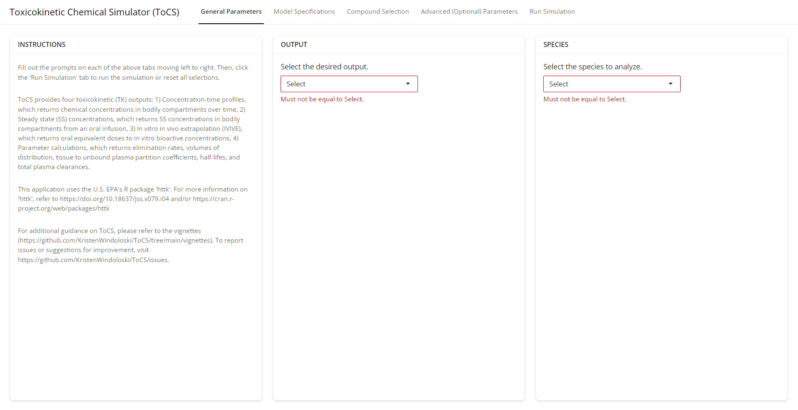{width="100%"}

<br/><br/>

## Example 1

In this example, let's say we want to generate human steady state concentrations in whole body plasma. We want to use a constant daily dose of 1 mg/kg BW with the PBTK model and make compounds with only in silico generated parameters (hepatic clearance, fraction unbound in plasma) also available for selection. We do not have specific chemicals in mind, so we will just select chemicals from the preloaded list of chemicals.

### General Parameters Tab

Under the *Output* card, we select *Steady state concentrations* since that is the type of simulation we want to run. Under the *Species* card, we select *Human* for the first drop down menu. The completed *General Parameters* card is shown in the image below.

<br/><br/>

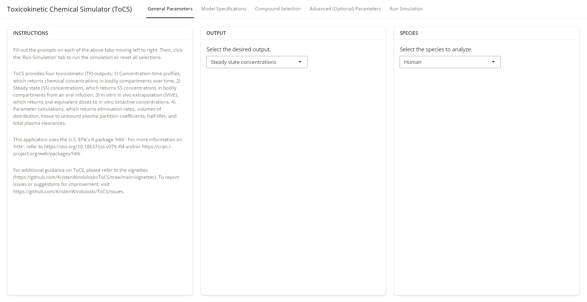{width="100%"}

<br/><br/>

### Model Specifications Tab

Under the *Dosing* card, we leave the total daily dose as its default value of 1 mg/kg BW. Under the *Model* card, we select *pbtk* for the first drop down to use the pbtk model. For the second drop down, we select *Yes* since we want to include compounds with only in silico generated parameters into the selection availability on the next page. Thus, the completed model specifications tab should look like the image below.

<br/><br/>

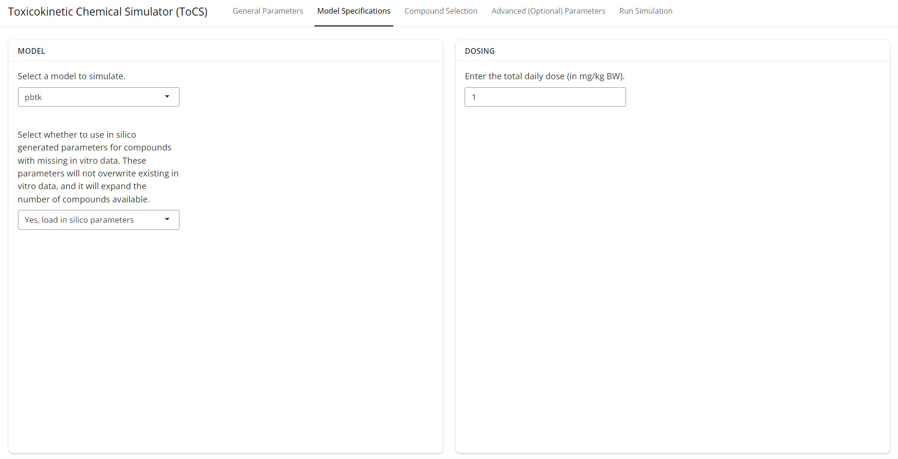{width="100%"}

<br/><br/>

### Compound Selection Tab

Since we selected to load in silico generated parameters, the *Preloaded Compounds* card will take a few moments to load. Once loaded, keep the first drop menu in the *Preloaded Compounds* card on *Choose from all available chemicals* and then search through the list and select 10 compounds:

  - Abamectin (CAS: 71751-41-2)
  - Aldicarb (CAS: 116-06-3)
  - Captan (CAS: 133-06-2)
  - Fenarimol (CAS: 60168-88-9)
  - Hexanedioic acid (CAS: 124-04-9)
  - Isoborneol (CAS: 124-76-5)
  - Pyrene (CAS: 129-00-0)
  - Sodium Cyclamate (CAS: 139-05-9)
  - Thiabendazole (CAS: 148-79-8)
  - Tribufos (CAS: 78-48-8)
  
We leave the *Uploaded Data* card as is, and the completed *Compound Selection* tab should look like the image below.

Note that if we selected *No* on the previous *Model Specifications* tab for using in silico generated parameters then captan, hexanedioic acid, isoborneol, and sodium cyclamate would not be available for simulation under the *Preloaded Compounds* card (i.e. these compounds use in silico generated parameters instead of human in vitro data).


<br/><br/>

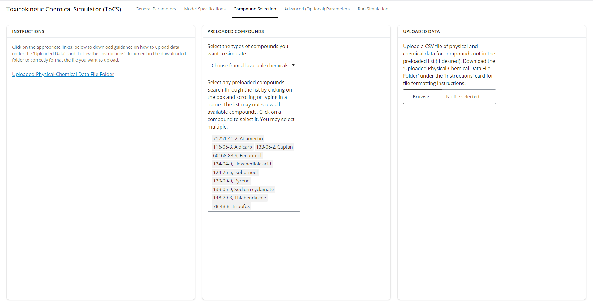{width="100%"}

<br/><br/>

### Advanced (Optional) Parameters Tab

Since we want to output steady state concentrations for whole body plasma, we leave the selections under the *Output Specification* card as their default values. We also leave the remaining three cards as their default values and proceed to the final tab. The *Advanced Parameters* tab should look like the image below.

<br/><br/>

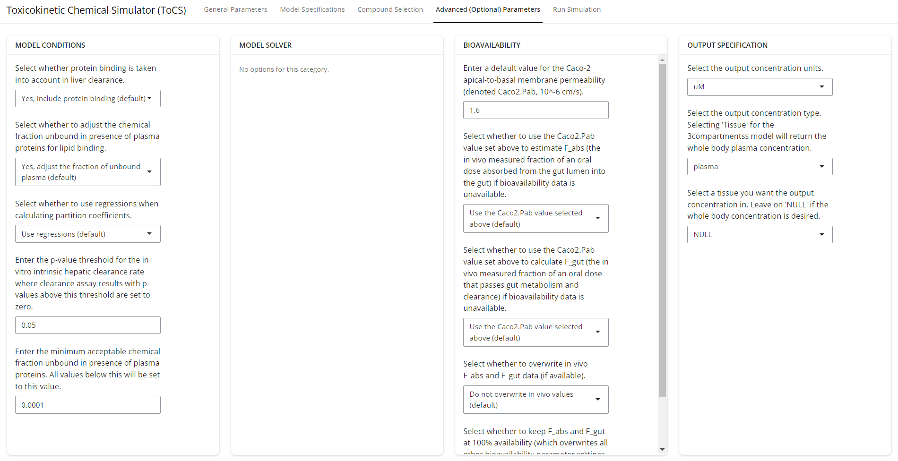{width="100%"}

<br/><br/>

### Run Simulation Tab

Now that we've completed all selections and the compounds we selected appear under the *Selected Compounds* card, we hit the *Run Simulation* button under the *Actions* card as shown in the image below. The simulation will take a few moments to complete. 

<br/><br/>

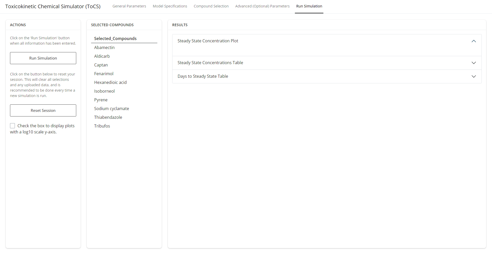{width="100%"}

<br/><br/>

The image below shows what the *Run Simulation* tab should look like once the simulation is finished. The first drop down bar under the *Results* card shows a single plot of the analytical steady state concentration for each selected compound in ascending order on a linear y-axis. Users have the option to download the steady state concentration plot by clicking the *Download Figure 1* button at the top of the plot.

<br/><br/>

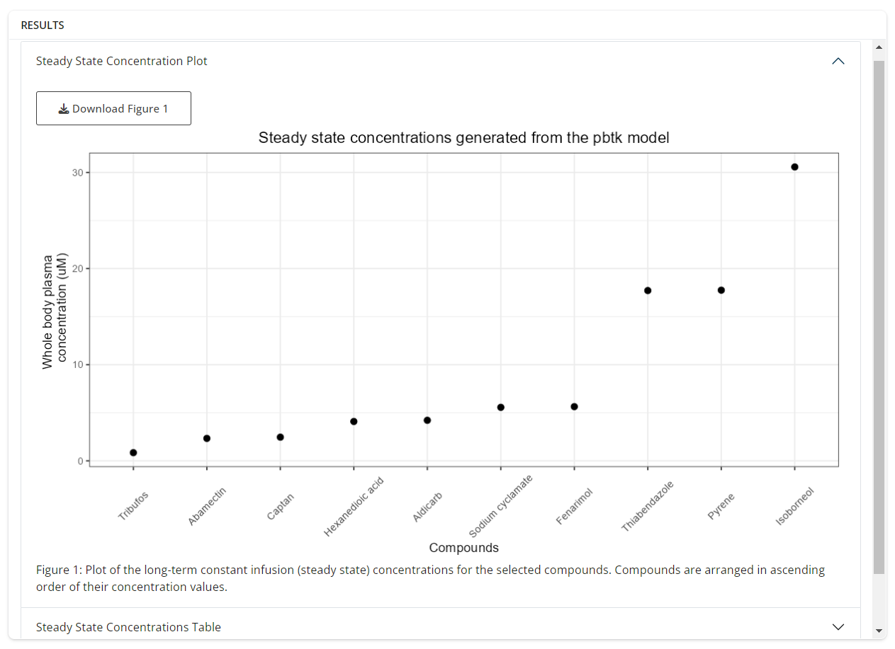{width="100%"}

<br/><br/>

If the user wants to see the steady state concentrations plot with a log10 y-axis, then the user can check the box at the bottom of the *Actions* tab as shown in blue in the image below. Then, the plot under the first drop down will transform its y-axis to a log10 scale. The user should select this plotting view if there are a vast difference of magnitudes in steady state concentrations across all of the compounds and it is challenging to visualize the smaller concentrations.

<br/><br/>

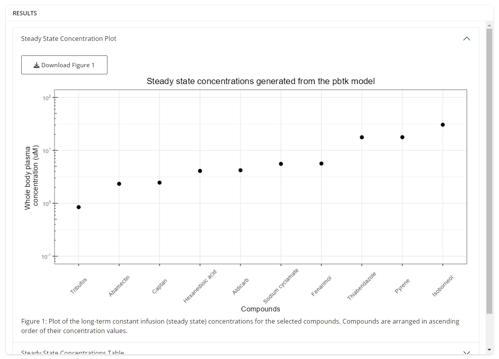{width="100%"}

<br/><br/>

The second drop down tab contains a table with the numerical values of the steady state concentrations that were plotted in the previous tab. This table is available for download if the user clicks the *Download Table 1* button at the top of the tab. The user is also able to download the simulation parameters used to generate the steady state concentrations by clicking the *Download Simulation Parameters* button.

<br/><br/>

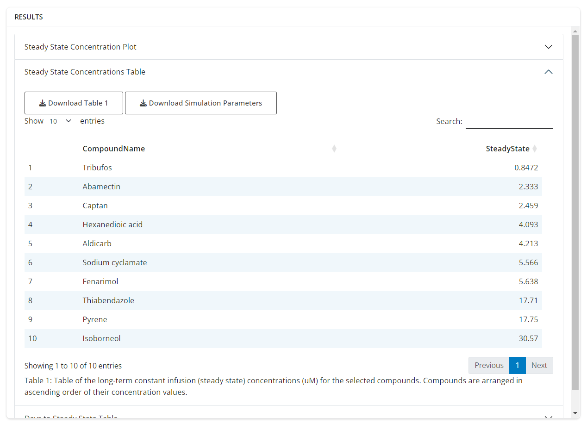{width="100%"}

<br/><br/>

The final drop down tab under the *Results* card contains a table of steady state characteristics for each of the compounds. The simulation that generates this table determines the number of days (CssDay) it takes for the compound to come within a certain percentage of analytical steady state value from the table in the tab above, the average concentration on the last day of the simulation (AvgConc), the ratio of the average concentration to the analytical steady state concentration (RatioAvgAnalytical), and the maximal concentration of the simulation (MaxConc). The user can download this table by clicking the *Download Table 2* button at the top of the tab. The table should look like that in the image below.

<br/><br/>

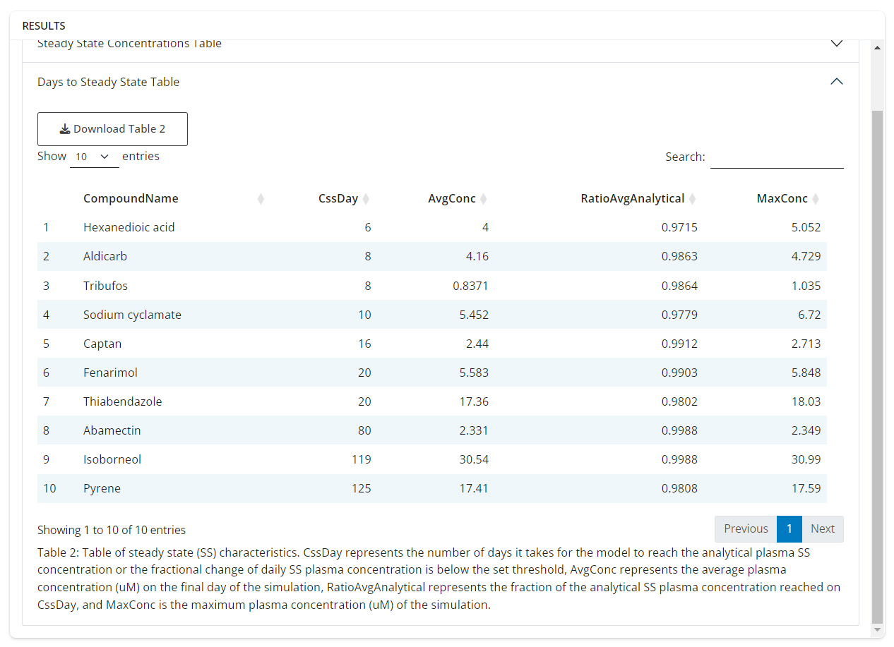{width="100%"}

<br/><br/>

If the user wanted to run a new simulation, we suggest clicking the *Reset Session* button under the *Actions* card, which will reset all parameter values and return the user to the starting interface.

## Example 2

In this example, let's say we want to generate human steady state blood concentrations in the liver for a constant daily dose of 2 mg/kg BW using the 1compartment model without in silico generated parameters for hepatic clearance, fraction unbound in plasma, and caco-2 permeability. Suppose we want to generate these concentrations for the following compounds: Valproic Acid (CAS: 99-66-1), Endosulfan (CAS: 115-29-7), Abamectin (CAS: 71751-41-2), Titanium Dioxide (CAS: 13463-67-7), and Advantame (CAS: 714229-20-6).

### General Parameters Tab

We select the same parameters for each of the drop downs on the *General Parameters* tab as in Example 1, shown below. Now, the user can continue to the *Model Specifications* tab.

<br/><br/>

{width="100%"}

<br/><br/>

### Model Specifications Tab

Under the *Dosing* card, we enter *2* into the text box for the 2 mg/kg BW dose. Under the *Model* card, we select *1compartment* for the simulation model with the first drop down menu. For the second drop down, we select *No* since we do not want to include compounds that use in silico parameters in place of missing in vitro parameters. The completed *Model Specifications* card should look like the image below.

<br/><br/>

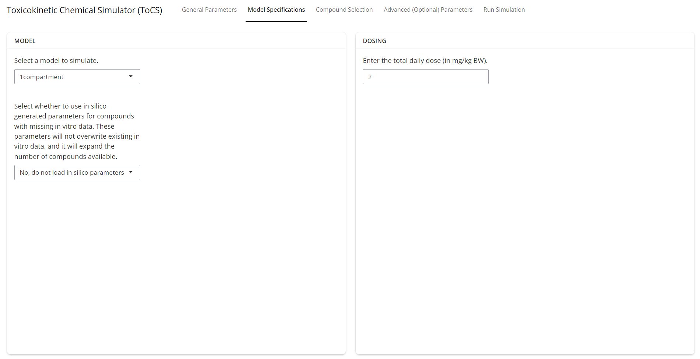{width="100%"}

<br/><br/>

### Compound Selection Tab

We keep the first drop menu in the *Preloaded Compounds* card on *Choose from all available chemicals* and then in the second drop down menu, we search for all five compounds but only three (valproic acid, endosulfan, and abamectin) are available. The remaining two, titanium dioxide and advantame, will have to be uploaded under the *Uploaded Compounds* card. Therefore, we upload the chemical information for titanium dioxide and advantame by copying the SampleCSV file in the *Uploaded Compound File Folder* under the *Instructions* card and entering the appropriate chemical information for each compound. See the *Introduction to ToCS* vignette for more information on upload instructions. For the purpose of this example, we use fake chemical data and upload the following csv file by clicking *Browse* under the *Uploaded Compounds* card.

<br/><br/>

```{r echo = FALSE, results='asis'}
library(knitr)
library(kableExtra)
SampleChemsToUpload <- read.csv("CSVs/CSV_SSvignette.csv")
kable(SampleChemsToUpload, caption = "A csv file with chemical information for titanium dioxide and advantame. Data other than the chemical identifiers and molecular weight (MW) are fictional.") %>%    kable_styling() %>%
  scroll_box(width = "100%")
```

<br/><br/>

Once we have the three compounds selected under the *Preloaded Compounds* card and the two compounds uploaded under the *Uploaded Compounds* card (with the csv file name CSV_SSvignette.csv), we then proceed to the next tab. The final *Compound Selection* tab should look like the image below.

<br/><br/>

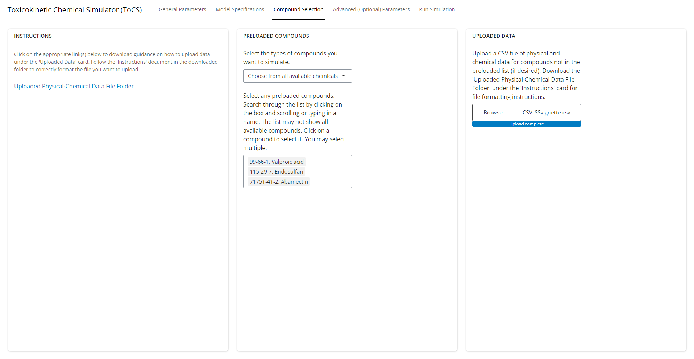{width="100%"}

<br/><br/>

### Advanced (Optional) Parameters Tab

Since we want the steady state blood concentrations in the liver, we customize the second and third drop down menus under the *Output Specification* cards to be *blood* and *liver*, respectively. There are no other customizations we want to make on this page, so the final *Advanced Parameters* page should look like the image below.

<br/><br/>

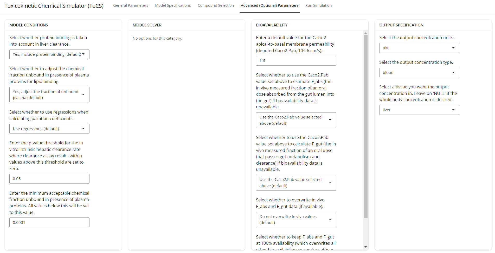{width="100%"}

<br/><br/>

### Run Simulation Tab

Now that all user selections have been made and all selected compounds appear under the *Selected Compounds* card, we are ready to run the simulation. So, we hit the *Run Simulation* button and when the simulation is complete, the results should look like the image below. The plot shows the steady state concentration for all five selected compounds with the user option to download the figure by clicking the *Download Figure 1* button.

<br/><br/>

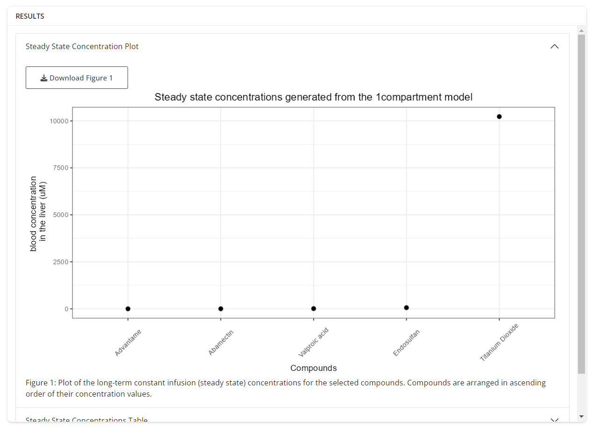{width="100%"}

<br/><br/>

Now, given that the outputted plot doesn't provide much visual information since four of the five compound steady state concentrations are significantly smaller than the largest one, we alter this figure by checking the bottom box under the *Actions* card, which will change the y-axis to a log10 scale as shown in the image below. This new plot provides a much clearer visual as to the steady state concentration value for each of the compounds. Note that the log10 scale checkbox can be checked before the user hits the *Run Simulation* button as well.

<br/><br/>

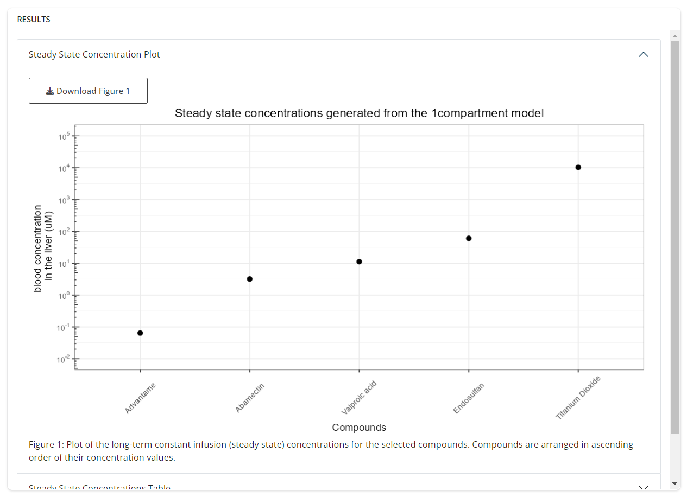{width="100%"}

<br/><br/>

The second drop down tab under the *Results* card shows a table of the steady state concentrations plotted in the first tab, as seen in the image below. The user has the option to download this table by clicking the *Download Table 1* button directly under the tab. The concentrations are shown in ascending order.

<br/><br/>

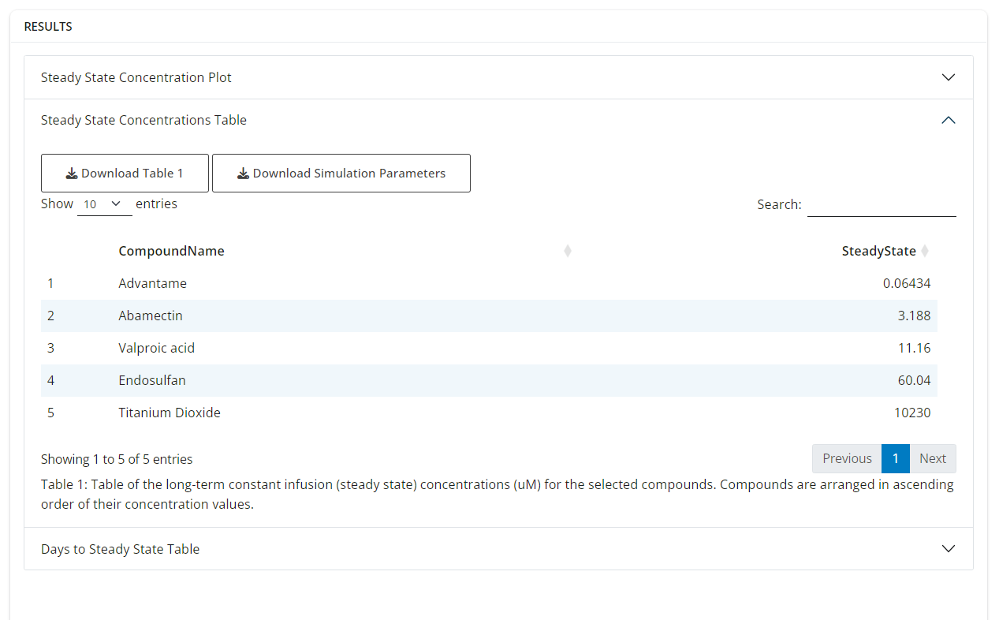{width="100%"}

<br/><br/>

The final tab under the *Results* card shows steady state characteristics for each compound, as seen in the image below. The description for each of the columns in this table is explained in Example 1 and in the figure caption. The table can be downloaded by the user if the user clicks the *Download Table 2* button.

<br/><br/>

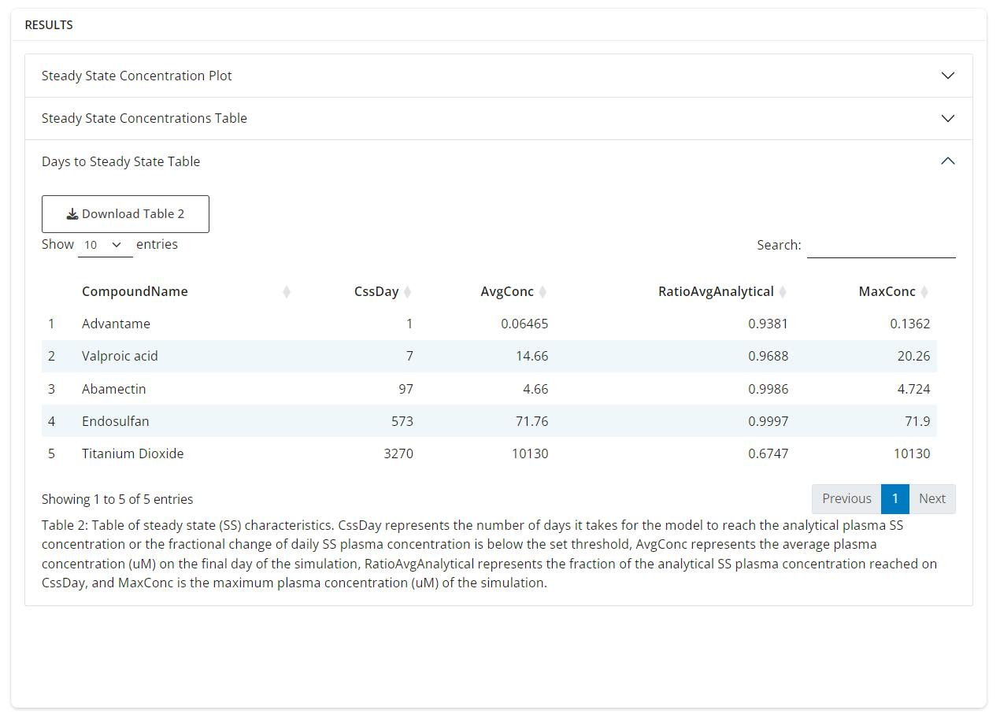{width="100%"}

<br/><br/>

As with the previous example, we suggest that the user clicks the *Reset Session* button if they want to run another simulation.
